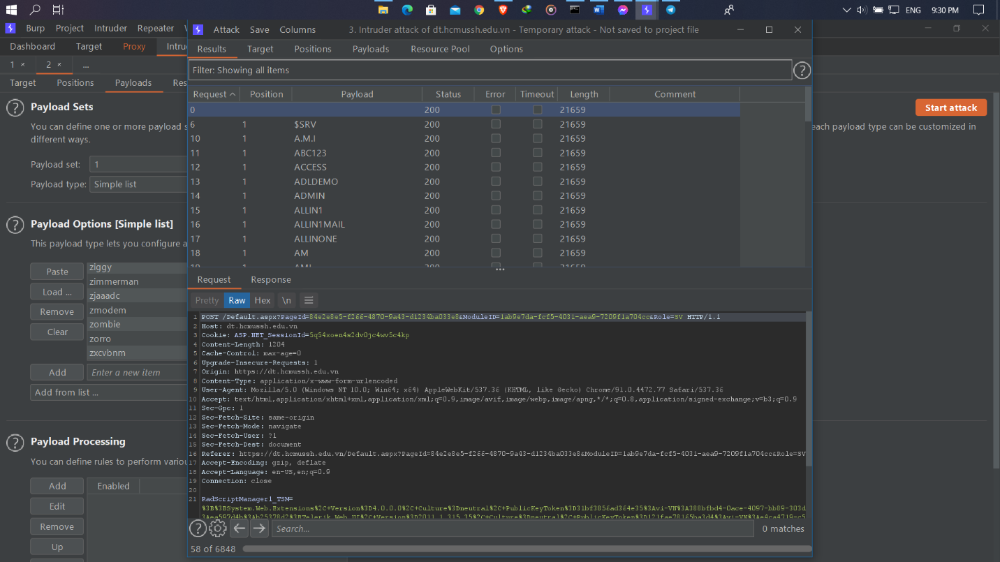

# Burp Suite

## I. Giới thiệu về Burp suite

-	Burp suite là một công cụ hỗ trợ cho việc kiểm thử bảo mật của web. Với số lượng người dùng lớn, các tính năng hỗ trợ mạnh mẽ và giao diện rất dễ dùng.

-	Ngoài ra phiên bản Professional và Enterprise hỗ trợ thêm công cụ quét lỗi bảo mật tự động

## II. Cài đặt Burp suite

-	Truy cập trang web [https://portswigger.net/burp/](https://portswigger.net/burp/) và tải về 1 trong 3 bản Enterprise/Professional (có phí), Community(miễn phí) 

-	Có 2 loại phiên bản, viết trên java (.jar) hoặc các phiên bản thích hợp cho các hệ điều hành windows, linux, mac-os. Nếu bạn tải phiên bản jar thì cài đặt sẽ phức tạp hơn và máy tính cần phải cài đặt sẵn java, còn các phiên bản còn lại thì chỉ cần chạy file để cài.

## III. Cấu hình Burp Suite để hoạt động

-	Một trong những tính năng quan trọng của burp suite là proxy, khi mới cài đặt thì bạn chỉ có thể sử dụng chúng trong trình duyệt đặc biệt của burb là burb embedded browser, để có thể sử dụng trên các trình duyệt khác thì chúng ta cần thêm một vài bước:

Bước 1:	Vào tab *Proxy -> Options* -> Kiểm tra xem Proxy Listener đã running chưa

Bước 2:	Tiếp theo mở trình duyệt lên, thay đổi proxy của trình duyệt theo IP và server tương ứng. (có thể sử dụng extension như Foxy Proxy để chuyển đổi dễ dàng).

Bước 3:	Chạy burp suite và truy cập vào trang [http://burpsuite/](http://burpsuite/) để lấy CA Certificate về, ở bước này nếu truy cập không thành công bạn nên thử đổi sang port khác hoặc tham khảo [https://portswigger.net/burp/documentation/desktop/getting-started/proxy-troubleshooting](https://portswigger.net/burp/documentation/desktop/getting-started/proxy-troubleshooting)

Bước 4:	Mở file đã tải, chọn *Install Certificate -> Next -> Place all certificate in the following store -> Trusted Root Certification Authorities* là xong

## IV. Các tính năng cơ bản của Burp Suite

### 1) Proxy

-	Đây là một proxy web chặn hoạt động như một người trung gian giữa trình duyệt cuối và ứng dụng web đích. Nó cho phép bạn chặn, kiểm tra và sửa đổi các gói tin đi qua theo cả hai hướng. 

-	Từ đây chúng ta có thể chỉnh sửa, gửi đi, bỏ qua hoặc chuyển gói tin sang các chức năng khác như intruder, repeater, …

### 2) Intruder

-	Tính năng này dùng để truyền tự động truyền payload lên server, sau đó phân tích kết quả trả về (thường dùng cho việc tấn công brute force) 

Giả sử chúng ta đang truy cập tới trang đăng nhập trường đại học nhân văn, trang này sử dụng http nên ta có thể thấy được username và password khi gửi đi, chặn gói tin này và chuyển sang tab intruder

Chọn 2 giá trị cần attack là username và password

Chọn payload list tự tạo hoặc mặc định

Chọn start attack để tiến hành attack

Kết quả trả về sẽ ở tab respone

### 3) Repeater

-	Tính năng giúp chỉnh sửa các thủ công các request, gửi đến server và phân tích gói tin respone trả về

Ví dụ như ta truy cập trang [facebook.com](facebook.com) bằng máy tính cá nhân, bắt gói tin và gửi đến repeater

Tại đây ta có thể chỉnh sửa các thông tin ở request, giả sử ta thay đổi chuỗi user-agent thành: *Mozilla/5.0 (iPhone; CPU iPhone OS 10_3_1 like Mac OS X) AppleWebKit/603.1.30 (KHTML, like Gecko) Version/10.0 Mobile/14E304 Safari/602.1 (dành cho safari trong ios)*

Có thể thấy là giao diện trả về lúc này là dành cho facebook khi sử dụng điện thoại (safari trong ios)

### 4) Scan

-	Đây là chức năng quét các lỗ hổng web tiên tiến, tự động thu thập thông tin và kiểm tra nhiều loại lỗ hổng.

-	Chỉ có ở bản pro

Để sử dụng ta nhấn vào *Dashboard -> New Scan* nhập url cần scan và nhấn ok để burp site tự động scan toàn bộ 

Nếu muốn custom scan, ấn vào tab Scan configuration

Sau đó chọn new để tạo mới hoặc import nhập file hoặc select from library để chọn kiểu scan phù hợp, nhấn ok và scan

Khi scan thì các issue sẽ hiển thị ở phần tab issue activity

## V. Tổng kết

- Đây là một số tính năng cơ bản của Burp Suite, vẫn còn nhiều tính năng hay ho của Burp Suite mà mình chưa đề cập đến, các bạn có thể tham khảo tại

[https://portswigger.net/burp/documentation/desktop/tools](https://portswigger.net/burp/documentation/desktop/tools)

