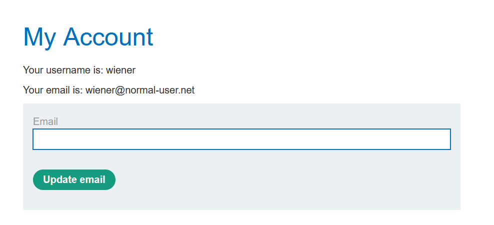
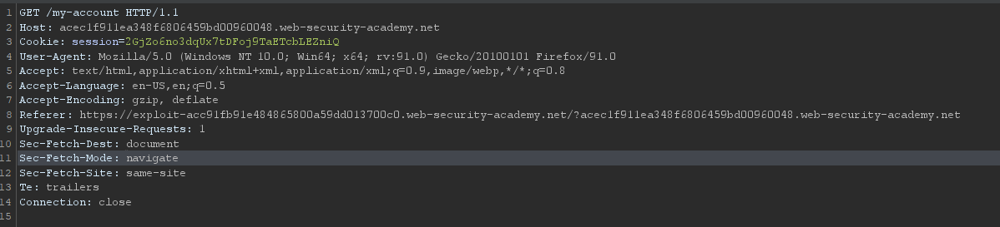

# Cross-site request forgery (CSRF)

## Lí thuyết

### CSRF là gì?

CSRF là một lỗi bảo mật web cho phép hacker khiến nạn nhân thực hiện một hành động nào đó mà họ không mong muốn.

### Hacker có thể làm gì với CSRF?

Với lỗi CSRF, hacker có thể khiến ngươời dùng thực hiện một hành động nào đó mà họ không mong muốn, có thể là thay đổi email, password đăng nhập. Hacker có thể thực hiện toàn bộ các chức năng mà người nạn nhân có quyền hạn dưới tên của nạn nhân. Hoặc nếu tài khoản nạn nhân có những đặc quyền cao hơn như tài khoản admin, hacker có thể chiếm quyền điều khiển hệ thống.

### Nguyên nhân xảy ra CSRF?

Có 3 điều kiện để xảy đến CSRF:

```
1) Có một hành động nào đó mà hacker muốn thực hiện trên tài khoản nạn nhân. (Có thể liên quan đến hệ thống hoặc dữ liệu cá nhân)
2) Server xác minh người dùng thông qua cookie được đặt ở browser nạn nhân sau khi đăng nhập
3) Các thông số của request hoàn toàn có thể tạo giả hoặc quá dễ để dự đoán (giúp hacker có thể tạo ra một fake request hợp lệ)
```

Ví dụ về tấn công CSRF

Giả sử một trang web có chức năng cho phép người dùng thay đổi email chẳng hạn, khi người dùng thay đổi email thì một request gửi đến cho server như sau


Thỏa 3 yêu cầu của CSRF:

```
1) Hành động đổi email sau đó có thể sẽ là reset password, như vậy hacker hoàn toàn chiếm được tài khoản
2) Server xác minh người dùng bằng cookie
3) Không có tham số nào khác ngoài email thay đổi (có thể làm giả request rất dễ dàng)
```

Để khai thác, hacker có thể tạo ra một đoạn mã HTML như sau


Hacker đặt đoạn mã này vào một trang web của hắn và gửi đường link tới cho user. User khi nhấp vào link sẽ tự động gửi request đến trang web có lỗi CSRF, và vì nó được thực hiện trên trình duyệt máy nạn nhân, trình duyệt sẽ tự động thêm cookie của người dùng vào (giả sử không dùng SameSite cookie). Sau đó trang web có lỗi CSRF nhận được request và xác minh (kiểm tra cookie khớp) và tiến hành đổi email thành giá trị mà hacker mong muốn.

### Mức độ nguy hiểm của CSRF

Về cơ bản, CSRF lợi dụng việc xác minh người dùng thông qua cookie và các tham số còn lại hoàn toàn có thể làm giả. Vì vậy chỉ cần một cách nào đó, hacker có được cookie của người dùng, cuộc tấn công CSRF sẽ được diễn ra. Trong ví dụ trên, hacker lợi dụng việc trình duyệt tự động thêm cookie vào các request để tiến hành cuộc tấn công CSRF. Cách tấn công cũng tương tự như Reflected XSS khi nó yêu cầu người dùng nhấn vào một đường link độc hại. Hacker có thể dụ nạn nhân nhấn vào thông qua email hoặc thông qua các comment trên các mạng xã hội, ... Một biến thể nguy hiểm hơn xảy ra nếu các request là GET, khi đó hacker có thể dễ dàng kết hợp chúng với các lỗi bảo mật web khác. Ví dụ kết hợp chúng với XSS như sau:


Khi người dùng vào trang web dính lỗi XSS (không cần cùng domain), một GET request kèm cookie người dùng sẽ tự động gửi đến server và server sẽ tự động đổi email nếu cookie là hợp lệ.

Một khi tấn công CSRF thành công, hacker có thể tiến hành toàn bộ các hành động mà nạn nhân được phép dưới tên nạn nhân. Các tác hại của CSRF thường không nghiêm trọng như XSS, vì nó giới hạn trong các hành vi mà nạn nhân được phép, (khác với XSS có thể là bất cứ câu lệnh gì).

### Phòng chống CSRF

Cách đơn giản nhất để phòng chống CSRF, đó là khiến cho hacker không thể tạo ra, một fake request. Một trong các cách hữu hiệu nhất là `CSRF tokens`. Một cách bổ trợ khác là `SameSite cookie` hoặc `HTTP Referer header`.

#### CSRF Tokens

CSRF Token là một chuỗi độc nhất, bí mật, và không thể dự đoán trước tạo ra từ phía server nhằm ngăn chặn hacker tạo ra các fake request (hacker không thể biết được giá trị của CSRF token)


CSRF nên được tạo bằng các thuật toán mật mã học kết hợp với các giá trị random và secret đủ tốt để hacker không thể dự đoán. 

CSRF được chuyển đến client của người dùng thông qua HTML, ví dụ server sẽ thêm một trường ẩn vào HTML Form như sau\


Giá trị trường value sẽ thay đổi dựa trên cookie request và được lưu lại trong server, như vậy hacker sẽ không thể biết được giá trị của csrf-token để tạo ra fake request. Token sẽ được gán vào khi người dùng sử dụng phương thức POST. Như vậy, chỉ khi nào phương thức POST được gửi từ chính xác trang web có chứa csrf-token, request mới trở nên hợp lệ.

CSRF tuyệt đối không được nằm chung với cookie.

Để dễ hiểu hơn, chúng ta sẽ tóm tắt cách hoạt động của csrf-token như sau:

```
1) User login, server set seesion cookie, và tạo ra csrf-token tương ứng với seesion cookie và lưu trong database
2) Khi user truy cập vào trang có chức năng thay đổi email, server gửi csrf-token đã được tạo vào trong html respone gửi đến browser của user
3) User submit form và csrf-token được gửi chung đến server
4) Server kiểm tra cookie và csrf-token và xác minh người dùng
```

Vì csrf-token được tạo ra gắn liền với seesion cookie, tức hacker không thể nào biết được giá trị của csrf-token để tạo ra một request hợp lệ. Chỉ khi nào chính xác user có seesion cookie hợp lệ truy vấn đến trang thay đổi email thì csrf-token tương ứng với cookie đó mới được gửi đến browser client, và cần phải dùng chính xác giá trị đó để gửi trong POST request thì server mới accept.

Một CSRF Token tốt sẽ phải đạt các yếu tố sau:

```
-	Không thể đoán trước
-	Ràng buộc với phiên người dùng
-	Cần được xác minh nghiêm ngặc trước khi thực hiện các hành động liên quan
```

#### SameSite cookie

Ta có thể phòng tránh CSRF bằng cách dùng SameSite cookie để kiểm soát việc khi nào thì cookie sẽ được browser đính kèm trong request. Việc này sẽ ngăn browser tự động thêm cookie vào trong các fake request mà hacker tạo ra từ trình duyệt người dùng.

SameSite cookie là một thuộc tính của cookie được gán chung trong set-cookie respone header khi server đặt cookie vào browser người dùng. SameSite cookie mang 2 giá trị Strict hoặc Lax.


Khi SameSite cookie mang giá trị Strict, browser sẽ không bao giờ thêm cookie vào bất kì request nào đến từ một trang web khác. Đây là lựa chọn an toàn nhất nhưng nó sẽ ảnh hưởng khá nhiều đến trải nghiệm người dùng, đặc biệt là khi user (đã đăng nhập) nhấn vào liên kết đến web từ một bên thứ ba, lúc này user sẽ phải đăng nhập lại trước khi tương tác với web.

Khi SameSite cookie mang giá trị Lax, cookie sẽ đính kèm với request nếu thỏa 2 điều kiện sau.

```
+) Request sử dụng GET method
+) Yêu cầu đến từ điều hướng cấp cao nhất của người dùng, chẳng hạn như nhấp vào liên kết. Các yêu cầu khác, chẳng hạn như những yêu cầu được khởi tạo bởi tập lệnh, sẽ không bao gồm cookie.
```

Dùng SameSite cookie ở giá trị Lax sẽ giúp bảo vệ một phần chống lại CSRF, vì đa số các chức năng mục tiêu đều được triển khai bằng POST (Lúc này sẽ vừa ngăn chặn CSRF vừa không ảnh hưởng trải nghiệm người dùng). Tuy nhiên một số ứng dụng triển khai các hành động mục tiêu bằng GET hoặc cho phép nhiều cả GET và POST thì việc bảo vệ sẽ vô dụng.

Vì thể SameSite cookie chỉ nên được xem là phương pháp bổ trợ cho việc phòng chống CSRF kết hợp với CSRF token.

#### HTTP Referer header

HTTP Referer header là một tùy chọn request header chứa url của trang web dẫn tới tài nguyên được request. Sau đó xác minh yêu cầu đến từ tên miền của ứng dụng.

Một số ứng dụng sử dụng HTTP Referer header để phòng chống CSRF, tuy nhiên chúng không thực sự hiệu quả vì một vài trang web sẽ ẩn đi hoặc sửa đổi giá trị referer header vì lí do bảo mật.


## PortSwiggerLab

### Lab: CSRF vulnerability with no defenses

Link: [https://portswigger.net/web-security/csrf/lab-no-defenses](https://portswigger.net/web-security/csrf/lab-no-defenses)


Đề yêu cầu ta exploit CSRF ở việc đổi email, ở đây server không dùng bất cứ phương pháp bảo về CSRF nào cả.

Ta vào lab, đăng nhập vào account wiener:peter đề cho



Ta sẽ thử dùng chức năng đổi email và bắt gói tin với Burp Suite


Bắt gói tin với BurpSuite, ta thấy server không sử dụng tham số CSRF Token để bảo vệ

Sử dụng CSRF PoC của Burp Suite để tạo exploit


Patse vào exploit server


Store và Deliver exploit to victim, ta solve lab thành công


### Lab: CSRF where token validation depends on request method

Link: [https://portswigger.net/web-security/csrf/lab-token-validation-depends-on-request-method](https://portswigger.net/web-security/csrf/lab-token-validation-depends-on-request-method)


Lần này đề yêu cầu exploit CSRF, server đã ngăn chặn CSRF attack, tuy nhiên chỉ áp dụng trên một vài loại request.

Đầu tiên chúng ta thử login vào và đổi email, bắt gói tin với Burp Suite


Ta có thể thấy server có thêm biến csrf để ngắn chặn CSRF attack

Ta thử xóa hoặc thay đổi giá trị csrf


Không thành công, như vậy phương thức POST đã bị ngăn chặn CRSF, ta thử đổi sang kiểu request khác theo gợi ý của đề, đổi thử sang kiểu GET


Thành công, như vậy ở phương thức GET server không kiểm tra csrf, ta có thể dùng phương thức GET để tấn công

Tạo ra exploit giống như bước trước và gửi đến victim


Thành công :v


### Lab: CSRF where token validation depends on token being present

Link: [https://portswigger.net/web-security/csrf/lab-token-validation-depends-on-token-being-present](https://portswigger.net/web-security/csrf/lab-token-validation-depends-on-token-being-present)


Đề lần này vẫn giống lab trước

Ta thử bắt gói tin với Burp Suite


Ta thấy trường csrf xuất hiện để chống lỗi CSRF

Ta thử xóa đi tham số csrf


Như vậy là server chỉ kiểm tra csrf token khi tham số đó xuất hiện (giống với tên lab). Vậy ta chỉ cần xóa tham số đó khỏi exploit là xong. Tạo exploit vằng CSRF PoC và làm y hệt các bước trên
 
 
 
Thử với exploit server


Thành công rồi :vv


### Lab: CSRF where token is not tied to user session

Link: [https://portswigger.net/web-security/csrf/lab-token-not-tied-to-user-session](https://portswigger.net/web-security/csrf/lab-token-not-tied-to-user-session)


Đề vẫn yêu cầu ta khai thác lỗi CSRF ở hàm đổi email. Lần này đề gợi ý rằng CSRF token không tích hợp chặt chẽ với xử lí phiên của hệ thống. Và đề cho ta 2 tài khoản. Dựa vào thông tin đề cho, ta đoán rằng CSRF token không liên quan đến seesion cookie.

Thử đăng nhập vào tài khoản 1 và lấy CSRF token


Ta có token `csrf=M4FDOwHtyYK7cgkJpAgx6ZRd8eRo4rT7`

Thử dùng token vừa tìm được để request cho tài khoản thứ 2


Ta thấy rằng request vẫn thành công, vậy ta có thể dùng lại csrf token vừa tìm ở trên để tấn công CSRF


Tạo exploit với giá trị của csrf được gán sẵn


Store và Send to victim

Tuy nhiên tới bước này mình lại không thành công, sau vài bước thử lại, mình nhận ra rằng CSRF token chỉ dùng dc 1 lần ở bất kì tài khoản nào. Vì vậy chúng ta cần tạo lại CSRF Token và tạo lại payload (lưu ý CSRF Token phải chưa sử dụng qua lần nào)


Thử đổi lại thành giá trị csrf mới được tạo


### Lab: CSRF where token is tied to non-session cookie

Link: [https://portswigger.net/web-security/csrf/lab-token-tied-to-non-session-cookie](https://portswigger.net/web-security/csrf/lab-token-tied-to-non-session-cookie)


Đề lần này vẫn là lỗi CSRF ở hàm đổi email, lần này server sử dụng token để chống CSRF, tuy nhiên đề gợi ý là chúng không tích hợp chặt chẽ với phiên làm việc

Thử bắt gói tin với Burp Suite với account wiener


Ta lấy được csrf token và csrf key tương ứng, thử dùng nó để verify cho account thứ 2


Verify thành công, như vậy seesion cookie và csrfKey không liên quan đến nhau, như vậy ta có thể dùng một cặp csrfKey và csrftoken phù hợp để tiến hành CSRF attack. Việc tiếp theo cần làm là gán được csrfKey vào cookie người dùng, sau đó gán CSRF token trong form submit, như vậy là thành công.

Ta sẽ tạo payload như sau


Gửi đến victim và kết quả thành công


Chi tiết cách hoạt động như sau, đầu tiên khi người dùng click vào link chứa exploit, server sẽ request một ảnh có scr=[https://ac461f1f1f080e2f8064273000a800ae.web-security-academy.net/?search=test%0d%0aSet-Cookie:%20csrfKey=PDvOBLOWUKShAC0hp2A5Dtc7YpW8yy6X]()

Sau khi request xong thì ảnh sẽ server sẽ gán cookie `csrfKey= PDvOBLOWUKShAC0hp2A5Dtc7YpW8yy6X` vào browser người dùng

Sau đó vì việc load ảnh lỗi nên sẽ trigger việc submit form và gửi kèm csrf token hợp lệ với csrfkey, server nhận được request và xử lí bình thường.


### Lab: CSRF where token is duplicated in cookie

Link: [https://portswigger.net/web-security/csrf/lab-token-duplicated-in-cookie](https://portswigger.net/web-security/csrf/lab-token-duplicated-in-cookie)


Lần này cơ chế bảo vệ sử dụng là đouble submit

Thử bắt một gói tin bằng Burp Suite


Ta có thể thấy csrf token và csrf key của cookie giống hệt nhau theo cơ chế double submit

Như vậy ta chỉ cần đặt csrfkey cookie hợp lệ vào browser người dùng và sử dụng chúng cho csrf token là có thể tấn công CSRF

Ta lợi dụng hàm search để set cookie giống như lab trước


Lưu ý rằng csrf token và csrfkey được set phải giống hệt nhau


Thành công


### Lab: CSRF where Referer validation depends on header being present

Link: [https://portswigger.net/web-security/csrf/lab-referer-validation-depends-on-header-being-present](https://portswigger.net/web-security/csrf/lab-referer-validation-depends-on-header-being-present)


Lần này đề dùng referer header để chống lại CSRF attack


Ta có thể thấy referer header nằm trong request

Thử xóa đi và gửi


Request vẫn thành công, vậy là trường Referer Header không bắt buộc trong form request

Ta sẽ dùng `<meta name="referrer" content="no-referrer">` để bỏ đi trường referrer header trong trang web exploit của ta


Exploit thành công


### Lab: CSRF with broken Referer validation

Link: [https://portswigger.net/web-security/csrf/lab-referer-validation-broken](https://portswigger.net/web-security/csrf/lab-referer-validation-broken)


Đề yêu cầu bypass chức năng kiểm tra tên miền trong Referer Header

Ta bắt thử một gói tin


Ta thử xóa hoặc thay đổi giá trị trường Referer, request đều thất bại.


Ta thử bypass Referer bằng cách thay đặt Origin `acec1f911ea348f6806459bd00960048.web-security-academy.net` vào sau phần ?/ của truy vấn.


Hàm `history.pushState(‘’,’’,’/?acec1f911ea348f6806459bd00960048.web-security-academy.net’)` sẽ thêm phần `/? acec1f911ea348f6806459bd00960048.web-security-academy.net` vào sau truy vấn trong referer header để gửi đến server.

Ta thử dùng nó trên exploit server


Lúc này truy vấn của ta sẽ như sau



Chúng ta đã bypass được referer header vì một phần của host hợp lệ nằm trong referer header

Và thành công


