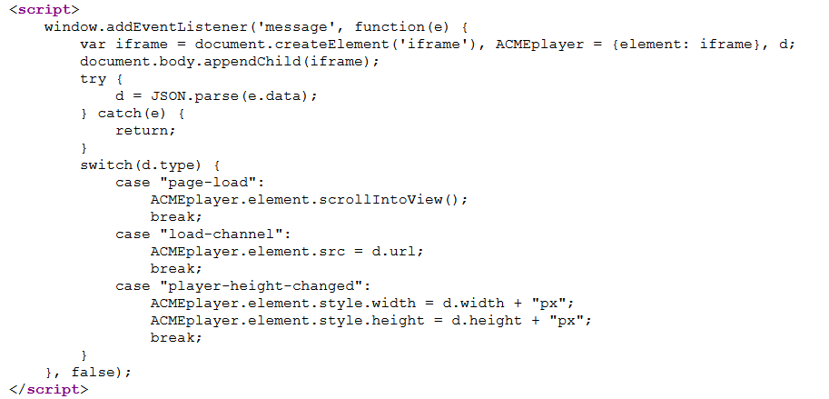

# DOM-based vulnerabilities

## Lí thuyết

### DOM là gì?

Document Object Model (DOM) là một biểu diễn phân cấp của các phần tử trên một trang web. Mỗi phần tử trên trang web sẽ được biểu phân cấp theo cây theo các node. Javascript sẽ tác động và thao tác với các node này, giúp chúng ta tùy biến trang web tốt hơn. Bản thân DOM không phải là một lỗi, nhưng cách javascript xử lí dữ liệu không an toàn với DOM có thể là nền tảng để tạo ra nhiều cuộc tấn công khác nhau.

### Taint-flow vulnerabilities?

Đa số các lỗ hỏng DOM-based vulnerabilities xảy ra do việc code ở phía máy khách (client code) xử lí dữ liệu có thể bị kiểm soát một cách không an toàn.

Ví dụ về DOM-based XSS (mượn từ `Lab: DOM XSS in document.write sink using source location.search` từ [https://portswigger.net/web-security/cross-site-scripting/dom-based/lab-document-write-sink](https://portswigger.net/web-security/cross-site-scripting/dom-based/lab-document-write-sink))


Truy cập vào lab, ta thấy những gì ta gõ trong thành search blog sẽ được truyền vao tham số `?search=` trong request url

Mở xem source của file


Ta thấy một đoạn code javascript như sau, đoạn này sẽ lấy giá trị biến search trên url và gán vào query, sau đó sẽ đưa vào tham số src của imb

Nếu ta search `cobra`, thì tag image sẽ là 

``

Vậy nếu ta search `"><svg onload=alert(1)>` thì sao?

`<svg onload=alert(1)> ">`


Có thể thấy ta đã gọi được lệnh alert(1) trên trình duyệt nạn nhân, lệnh alert(1) có thể là các lệnh nguy hiêm khác như gửi cookie, ... 

Đây là lỗi XSS đựa trên DOM-based, vì nguyên nhân dẫn đến việc chúng ta khai thác XSS nằm ở việc code java script ở client đã xử lí dữ liệu biến search một cách không an toàn (truyền thằng vào thuộc tính src của img). Biến search hoàn toàn có thể bị kiểm soát bởi hacker vì nó nằm trên url. Để gọi lệnh alert(1) trên máy nạn nhân như ví dụ trên, hacker chỉ cần gửi một đường link: [https://ac181feb1f60261b80e452ef00a2004c.web-security-academy.net/?search=%22%3E%3Csvg+onload%3Dalert%281%29%3E]()

Khi nạn nhân nhấp vào thì sẽ tự động bị tấn công như ví dụ trên.

Người ta gọi chung những lỗi như vậy là DOM-based vulnerabilities - các lỗi xảy ra do client code xử lí dữ liệu có thể kiểm soát bởi hacker một cách không an toàn.

### Phân biệt 2 khái niệm cơ bản là Sources và Sinks

 - Sources: là một thuộc tính của javacripts chấp nhận dữ liệu có khả năng bị hacker kiểm soát. Ví dụ: đường dẫn (document.referrer), cookie người dùng (document.cookie), web message, ...

Một số Sources có thể bị tấn công


 - Sinks: là một hàm javascripts hoặc một phần tử DOM tiềm ẩn nguy hiểm nếu nhận được dữ liệu của kẻ tấn công gửi đến. Ví dụ: hàm eval(), document.body.innerHTML, ...
Một số Sinks có thể bị tấn công


### Phòng chống DOM-based taint-flow vulnerabilities

Đây là một nhóm các lỗ hổng rất rộng và tổng quát, vì thế không có một biện pháp nào có thể hoàn toàn loại bỏ các lỗ hổng DOM-based taint-flow vulnerabilities.

Tuy nhiên như đã đề cập, các lỗi DOM-based chủ yếu xảy ra do client code xử lí dữ liệu không an toàn. Vì vậy cách tốt nhất là không cho phép dữ liệu tự nguồn không đáng tin cậy thay đổi các giá trị truyền đến Sinks.

Nếu như bắt buộc, thì các cơ chế bảo mật chặt chẽ cần được áp dụng, và bắt buộc phải áp dụng ở phía client code. Thông thường sẽ là mã hóa hoặc lọc theo các white list. Đây là một nhiệm vụ cực kì khó vì hacker có thể biết được trực tiếp mã nguồn của các cơ chế bảo mật để nghĩ cách bypass. Do đó nó cần được triển khai một cách phù hợp theo từng ngữ cảnh đặc biệt.

Như ví dụ ở bài LAB đã đề cập phía trên:

Nếu trước khi truyền vào thuộc tính src của img, chúng ta áp dụng một hàm lọc chặn kí tự `>` và `"`, thì hacker sẽ không thể lợi dụng để khai thác lỗ hổng XSS.
```
query.replace(">","");
query.replace("\"","");
```


## PortSwiggerLab

### Lab: DOM XSS using web messages and a JavaScript URL

Link: [https://portswigger.net/web-security/dom-based/controlling-the-web-message-source/lab-dom-xss-using-web-messages-and-a-javascript-url](https://portswigger.net/web-security/dom-based/controlling-the-web-message-source/lab-dom-xss-using-web-messages-and-a-javascript-url)


Đề cho một lỗi DOM-based redirection triggered bởi web mesaging, yêu cầu dùng exploit gọi hàm `print()`

Truy cập lab, ta thấy một đoạn như sau


Đoạn javascript này sẽ nhận các web message gửi đến, sau đó kiểm tra http và https có trong url hay không. Nếu có thì sẽ chuyển hướng đến trang đó bằng location.href

Tuy nhiên location.href có thể là một đoạn mã javascript khác chứa mã độc, chúng ta sẽ attack bằng cách gửi `e.data = javascript:print()//http:`, lúc này khi message nhận được sẽ trigger hàm `print()`.


Chúng ta sẽ gửi một iframe có src là bài lab đến cho nạn nhân, khi nạn nhân truy cập trang web của ta thì một web message được gửi đến và trigger hàm print() trên trình duyệt nạn nhân.


### Lab: DOM XSS using web messages and JSON.parse

Link: [https://portswigger.net/web-security/dom-based/controlling-the-web-message-source/lab-dom-xss-using-web-messages-and-json-parse](https://portswigger.net/web-security/dom-based/controlling-the-web-message-source/lab-dom-xss-using-web-messages-and-json-parse)


Đề yêu cầu exploit và gọi `print()`

Truy cập lab, ta thấy đoạn script sau



Ta thấy rằng đoạn script này sẽ tạo một iframe đựa trên web message nhận được, sau đó sử dụng switch case. Ta thấy trong `switch(d.type)` có một case là `load-channel` sẽ thay src của `iframe = d.url`

Vì vậy nếu ta gửi một web message có `d.type = load-channel` và `url = javascript:print()`, chúng ta sẽ trigger được hàm `print()`


Chúng ta sẽ tạo một iframe với src là bài lab của chúng ta, khi nạn nhân truy cập trang web của chúng ta, một web message sẽ được gửi với `type=load-channel` và `url=javascript:print()` sẽ tạo ra một iframe với `src=javascript:print()` và sẽ trigger hàm `print()` chạy trên trình duyệt nạn nhân.


### Lab: DOM-based open redirection

Link: [https://portswigger.net/web-security/dom-based/open-redirection/lab-dom-open-redirection](https://portswigger.net/web-security/dom-based/open-redirection/lab-dom-open-redirection)


Đề yêu cầu chúng ta khai thác lỗ hổng và chuyển hướng nạn nhân tới exploit server

Truy cập vào một blog nhất định và kiểm tra source, ta thấy đoạn sau


Khi người dùng nhấn vào back to blog

`returnUrl = /url=(https?:\/\/.+)/.exec(location)`

đoạn này sẽ lấy đường dẫn trang web và tìm một đoạn có regular exception là `/url=(https?:\/\/.+)/` gán vào biến `returnUrl`, và nếu tồn tại thì sẽ án vào `location.href` để chuyển hướng.

Vì vậy ta chỉ gán địa chỉ trang web ta muốn chuyển hướng nạn nhân (ở đây là exploit server) vào tham số url và gửi đến nạn nhân
[https://ac9f1fa21fb7bc7680d40c5d00610075.web-security-academy.net/post?postId=2&url=https://exploit-ac821ff31fcbbcde805f0c640162006c.web-security-academy.net/]()

Khi người dùng click vào link như sau, sau đó nhấn vào back to blog, đoạn `url=https://exploit-ac821ff31fcbbcde805f0c640162006c.web-security-academy.net/` match regular exception và chuyển hướng nạn nhân đến exploit server của ta

Truy cập đường link trên, ta solve thành công


### Lab: DOM-based cookie manipulation

Link: [https://portswigger.net/web-security/dom-based/cookie-manipulation/lab-dom-cookie-manipulation](https://portswigger.net/web-security/dom-based/cookie-manipulation/lab-dom-cookie-manipulation)


Đề yêu cầu chúng ta chèn cookie gây ra XSS trên một trang khác và gọi hàm `print()`

Truy cập vào đại một sản phẩm, ta thấy đoạn như sau:


Như vậy là địa chỉ trang web vừa truy cập sẽ được gán vào biến `lastViewedProduct` của cookie. Thử reload lại trang homepage với cookie đã được gán sẵn.


Ta thấy một trường mới xuất hiện là Last viewed product, chỉ xuất hiện khi ta đã truy cập ít nhất một product trước đó.

Kiểm tra source


 
Ta thấy địa chỉ trang web truy cập trước đó được gán vào trường href, giá trị này được lấy từ cookie gửi từ client người dùng, chỗ này sẽ gây ra lỗi XSS. Nếu ta có thể gán `productId=1"><script>print()</script>` ta sẽ gọi được hàm `print()` chạy. 

Như vậy ta cần thực hiện 2 bước

```
B1: Chuyển hướng người dùng đến trang có productId=1"><script>print()</script> và gán url nó vào cookie lastViewedProduct
B2: Chuyển đến trang home page để giá trị trường cookie lastViewedProduct được gán vào href và gây ra lỗi XSS để gọi hàm print()
```

Ta tạo payload như sau:


Thành công


### Lab: Exploiting DOM clobbering to enable XSS

Link: [https://portswigger.net/web-security/dom-based/dom-clobbering/lab-dom-xss-exploiting-dom-clobbering](https://portswigger.net/web-security/dom-based/dom-clobbering/lab-dom-xss-exploiting-dom-clobbering)


Đề yêu cầu thực hiện HTML injection để chèn biến và dùng XSS để gọi `alert()`

Truy cập vào một blog trong lab


Ta thấy đoạn scripts được load từ file `loadCommentsWithDomClobbering.js`


Trong hàm displayComments ta thấy 2 dòng như sau. Biến `window.defaultAvatar` tồn tại lỗ hổng DOM-based, vì chúng ta có thể tạo ra một object với `id=defaultAvatar`, như vậy thì src của img phía dưới sẽ bị tác động.

Vì comment của blog cho phép tạo HTML, nên ta dễ dàng tạo ra một nhóm DOM có id=defaultAvatar như sau
```
<a id=defaultAvatar>
<a id=defaultAvatar name=avatar href="cid:&quot;onerror=alert(1)//">
```

Khi đó thuộc tính `name=avatar` ở biến DOM thứ 2 sẽ gán giá trị href vào thuộc tính avatar của `window.defaultAvatar { avatar: "cid:&quot;onerror=alert(1)//"}`

Tính chất cid dùng để bypass hàm DOMPurify, nó sẽ chuyển đổi `&quot` thành `"` khi chạy.


Comment để inject HTML DOM-based

Sau comment thứ nhất xong, khi tạo lại comment thứ 2, lúc này biến `window.defaultAvatar` đã bị thay đổi, dẫn tới src của img phía dưới cũng thay đổi theo


Giá trị của img src của lần cmt thứ 2, ta đã gọi hàm alert(1) thành công.


Solve thành công


## Lab: Clobbering DOM attributes to bypass HTML filters

Link: [https://portswigger.net/web-security/dom-based/dom-clobbering/lab-dom-clobbering-attributes-to-bypass-html-filters](https://portswigger.net/web-security/dom-based/dom-clobbering/lab-dom-clobbering-attributes-to-bypass-html-filters)


Bài lab sử dụng thư viện `HTML janitor library` để filter các thuộc tính mà ta có thể đưa vào, vì phần comment cho phép HTML. Tuy nhiên hàm HTML Janitor này có một lỗ hổng là sử dụng thuộc tính `attributes` để filter. Tuy nhiên ta có thể ghi đè lên bằng cách tạo ra một DOM khác có `id=attributes`. Điều này cho phép ta bypass và đặt các thuộc tính bất kì mà ta muốn ở đây chúng ta dùng `onfocus=print()`

`<form id=x tabindex=0 onfocus=print()><input id=attributes>`

Đầu tiên ta tạo một comment nhằm bypass và đặt thuộc tính `onfocus=print()` vào trang web


Tiếp theo ta chỉ cần gửi đường dẫn [https://ac371f6a1efd2e2f80cc148200d10083.web-security-academy.net/post?postId=3#x]() tới nạn nhân, #x phía cuối sẽ khiến cho browser sẽ focus đến form ta tạo và từ đó trigger hàm print() trong thuộc tính onfocus


Đề yêu cầu ta dùng exploit server, vì vậy ta tạo một iframe trên exploit server với src=[https://ac371f6a1efd2e2f80cc148200d10083.web-security-academy.net/post?postId=3#x]()

Tuy nhiên ở đây để ý thêm một vấn đề là để trigger thành công thì form x sẽ phải được load thành công trước khi browser focus. Vì vậy ta thêm tham số delay(500ms) để đảm bảo hàm print() được trigger khi truy cập exploit server.


Đầu tiên iframe sẽ load với src ban đầu, tuy nhiên sau khi setTimeout(500) thì iframe sẽ tự động thêm #x vào source, nhằm focus vào form x và trigger hàm print()


