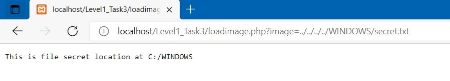

# Directory Traversal

## Directory Traversal là gì?

  -	Thông thường, chúng ta chỉ có thể truy cập đến các tài nguyên được chỉ định sẵn (ACLs), hoặc các tài nguyên nằm từ thư mục gốc của máy chủ web (root directory). Đây là 2 cơ chế bảo mật chính giúp ngăn người dùng truy cập những file nhạy cảm trên máy chủ.
  -	Directory Traversal (hay Path traversal) là lỗ hổng bảo mật web cho phép hacker truy cập đến các file tùy ý trên server chạy ứng dụng. Từ đó có thể đọc được những thông tin quan trọng của ứng dụng như thông tin đăng nhập, dữ liệu, file hoặc thư mục của hệ điều hành.
  -	Ngoài ra trong một số trường hợp khi được kết hợp với kiểu tấn công khác, hacker có thể chiếm quyền điều khiển server.

## Nguyên nhân xảy ra Directory Traversal?

  -	Do ứng dụng truy suất file dựa trên địa chỉ là input đầu vào của người dùng mà không kiểm tra input đầu vào cẩn thận.

## Ví dụ về Directory Traversal

Chúng ta có một trang web html đơn giản như sau, trong đó sử dụng file `loadimage.php` để load ảnh


Code của `loadimage.php`


Bình thường trang web sẽ load ảnh trong thư mục `images/(tên ảnh)` với tên ảnh nằm trong tham số get


Tuy nhiên vì không có cơ chế xác thực đầu vào tại tên file ảnh, nên hacker có thể lợi dụng lỗ hổng Directory Traversal để đọc được tất cả các file khác trên hệ thống như sau:



Với input tên file là `../../../../WINDOWS/secret.txt`, đường dẫn thư mục gốc của web là `C:\xampp\htdocs\Level1_Task3`, lúc này đường dẫn mà `loadimage.php` đọc là `C:\xampp\htdocs\Level1_Task3\..\..\..\..\WINDOWS\secret.txt`, dẫn đến việc file `secret.txt` mặc dù không nằm trong thư mục gốc của web vẫn có thể bị đọc. Hacker có thể lợi dụng lỗ hổng này để đọc toàn bộ các file còn lại trên server.

## Hacker có thể làm gì khi khai thác được lỗ hổng này?

  -	Truy cập, đọc được các file bị hạn chế trên server (đặc biệt là các file nhạy cảm như cmd.exe, win.ini trên windows hay /etc/passwd trên linux)
  -	Kết hợp với các lỗ hổng khác giúp chiếm quyền điều khiển server, ghi mã độc, ...

## Phòng tránh Directory Traversal

### Giai đoạn đang phát triển:

  -	Cách hiệu quả nhất để ngăn chặn Directory Traversal là tránh chuyển hoàn toàn đầu vào do người dùng cung cấp tới các filesystem API 
  -	Xác thực đầu vào mạnh:
  ```
  +) Chỉ cho phép các kí tự thuộc whilelist
  +) Chỉ chứa nội dung được phép (ví dụ chỉ có số, chữ)
  ```
  -	Chuẩn hóa đường dẫn, đảm bảo đường dẫn xuất phát từ thư mục gốc của web

Ví dụ với đoạn code trên trong php, ta có thể dùng hàm realpath để kiểm tra


Lúc này `$img` sẽ trả về realpath (không chứa `..` hay `.`) đồng thời kiểm tra xem phần đầu của realpath có khớp với địa chỉ thư mục gốc của trang web (mình đã test và nó thành công trên code của mình)

### Giai đoạn chạy thực tế:

  -	Cập nhất web server sofware lên phiên bản mới nhất và áp dụng các bản vá lỗi
  -	Sử dụng firewall để lọc đầu vào từ người dùng

## Nguồn tham khảo

  - [https://portswigger.net/web-security/file-path-traversal](https://portswigger.net/web-security/file-path-traversal)
  - [https://securitydaily.net/tan-cong-directory-traversal-la-gi/](https://securitydaily.net/tan-cong-directory-traversal-la-gi/)
  - [https://stackoverflow.com/questions/4205141/preventing-directory-traversal-in-php-but-allowing-paths](https://stackoverflow.com/questions/4205141/preventing-directory-traversal-in-php-but-allowing-paths)

