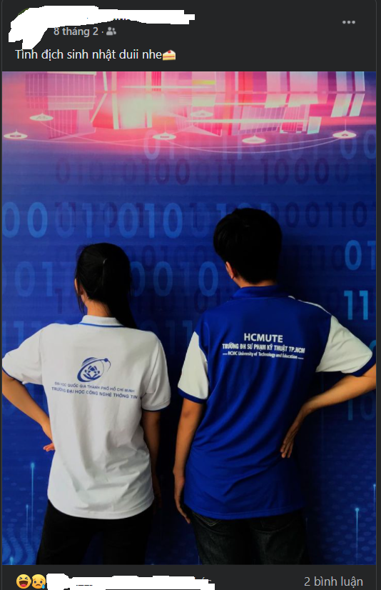
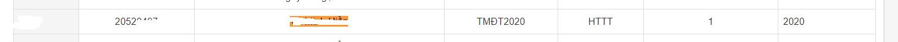
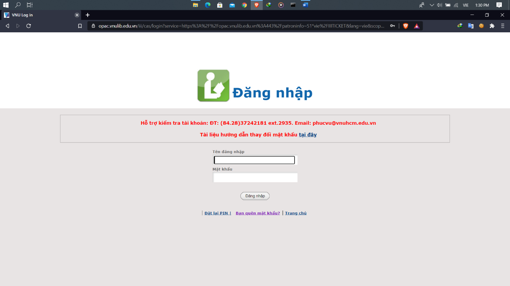
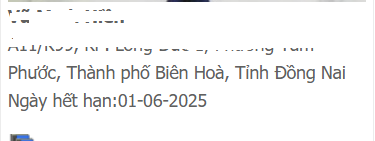

## Tôi đã tìm được địa chỉ nhà của trợ giảng như thế nào? 

Đôi khi chúng ta lộ thông tin ở nơi chúng ta không hề nghĩ đến! (Không dùng bất kì kĩ thuật chuyên ngành nào cả)

Một ngày đẹp trời nọ, tôi vô tình tìm được facebook của cô trợ giảng lớp học anh văn của tôi. Với bản tính tò mò, tôi quyết định lướt một chút. Bỗng tôi bắt gặp một thứ khá thú vị

Như vậy là trợ giảng học cùng trường với tôi. Hmmm... Là một học sinh của trường thì tôi biết được một vài nơi có thể tìm kiếm được thông tin từ học sinh trong trường, vì vậy tôi tiến hành thử. 

Đầu tiên là với trang quản lí điểm rèn luyện của học sinh trong trường, trang này luôn có một mục điểm rèn luyện dựa trên thành tích học tập của trường, và luôn đính kèm danh sách, tìm kiếm trên danh sách đó với tên "** **** ***". Tôi tìm được.

Chỉ có 1 cái tên "** **** ***" trong danh sách học sinh trường tôi, và tôi đã có được mã số sinh viên (mssv), không nhiều nhưng là bước đầu để khai thác nhiều thông tin hơn. Mssv của 1 sinh viên giống như chứng minh nhân dân vậy. Hầu như tất cả các hoạt động của trường đều sử dụng, và nếu biết khai thác đúng cách, ta sẽ thu được rất nhiều thông tin.

Trong bài này tôi ghi lại quá trình tìm kiếm địa chỉ nhà của trợ giảng thông qua một lỗi lộ thông tin rất cơ bản. Lỗi này đến từ trang web thư viện trung tâm của hệ thông trường học thuộc đại học quốc gia. Đây là trang web quản lí thông tin mượn sách trong các hệ thống thư viện. Và nếu đăng nhập được thì chúng ta sẽ tìm ra được một vài thông tin cơ bản. 

Và làm sao để đăng nhập??? Một trang web không có xác thực 2 bước cũng không có capcha, không có giới hạn số lần. Chúng ta có thể dùng một số tool để crack password. Tuy nhiên như đã nói ở trên, tôi không dùng bất kì kĩ thuật liên quan đến hack nào cả. Lí do tôi đăng nhập được là vì tài khoản ở đây là mặc định dành cho sinh viên với cấu trúc: tài khoản: 15000 + mssv, mật khẩu: 12345678. Thử đăng nhập và tôi đã thành công.

Tuy không phải quá nhiều nhưng điều đáng nói ở đây là: các thông tin này thật sự rất quan trọng, tuy nhiên tôi không cần phải là hacker hoặc quá hiểu biết để có thể tìm ra các thông tin này. Nó xảy ra vì một lỗi quá đơn giản và sự chủ quan của người sử dụng. Khi không đổi các mật khẩu hoặc không chú ý đến các mật khẩu được cấp sẵn. Điều này thường xảy ra do thói quen lười nhớ hoặc do họ ít khi phải sử dụng đến trang web này. 

Vì vậy nếu bạn đang đọc bài này, tôi khuyến cáo bạn ngay lập tức đổi các mật khẩu được cấp sẵn khi tạo các tài khoản. Và hãy đặt chúng khác nhau để không bị khai thác khi lộ 1 mật khẩu giữa những trang web khác nhau. (ví dụ: hầu hết mọi người đều sử dụng pass facebook, instagram, twitter giống nhau). 

Đôi khi không cần quá hiểu biết về công nghệ ta cũng có thể dễ dàng tìm được các thông tin quan trọng. Và các thông tin bị lộ ở những nơi mà chúng ta thường không nghĩ đến.

Blog is just for fun. Hope you enjoy it ^^
