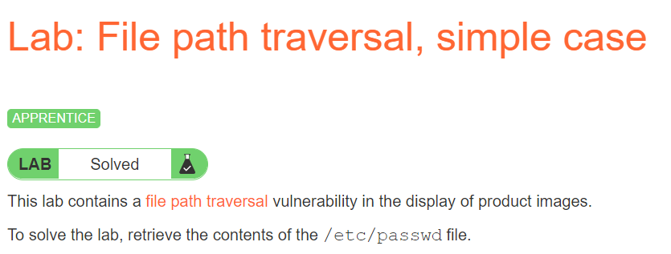

# Directory traversal

## Lab: File path traversal, simple case

### Link: [https://portswigger.net/web-security/file-path-traversal/lab-simple](https://portswigger.net/web-security/file-path-traversal/lab-simple)

Đề gợi ý lỗi path traversal nằm ở việc hiển thị các hình ảnh

Ta thấy các hình ảnh được truy suất bằng `/image?filename=`

Vì vậy có thể đây là nơi chứa lỗ hổng Directory traversal, ta refresh lại trang và dùng BuipSuite chặn một request ảnh.

Thử thay giá trị `filename=../../../etc/passwd` và xem kết quả

Kết quả trả về file `/etc/passwd` thành công

## Lab: File path traversal, traversal sequences blocked with absolute path bypass

### Link: [https://portswigger.net/web-security/file-path-traversal/lab-absolute-path-bypass](https://portswigger.net/web-security/file-path-traversal/lab-absolute-path-bypass)

Lỗ hổng của lab này và các lab sau đều giống với lab đầu nên mình không nói lại nữa, khác ở chỗ là kĩ thuật bypass để exploit lỗi.

Đề lần này yêu cầu chúng ta sử dụng đường dẫn tuyệt đối để bypass

Ta chỉ cần thay giá trị `filename=/etc/passwd` là thành công

## Lab: File path traversal, traversal sequences stripped non-recursively

### Link: [https://portswigger.net/web-security/file-path-traversal/lab-sequences-stripped-non-recursively](https://portswigger.net/web-security/file-path-traversal/lab-sequences-stripped-non-recursively)

Lần này đề yêu cầu chúng ta bypass hàm strip input của server, tuy nhiên theo tên đề gợi ý, hàm strip này không hồi quy, như vậy ta có thể bypass các filter `../` rất đơn giản bằng cách lồng 2 lần `....//` Đơn giản có thể giải thích như sau

Thay `filename=....//....//....//etc/passwd`, sau khi qua strip `filename=../../../etc/passwd`

Exploit thành công

## Lab: File path traversal, traversal sequences stripped with superfluous URL-decode

### Link: [https://portswigger.net/web-security/file-path-traversal/lab-superfluous-url-decode](https://portswigger.net/web-security/file-path-traversal/lab-superfluous-url-decode)

Lần này server sẽ sử dụng URL_decode trước khi sử dụng, vì vậy chúng ta chỉ cần url encode chuỗi `../../../etc/passwd` 2 lần

Như vậy payload chúng ta sẽ là `filename= ..%252F..%252F..%252Fetc%252Fpasswd`

Expoit thành công

## Lab: File path traversal, validation of start of path

### Link: [https://portswigger.net/web-security/file-path-traversal/lab-validate-start-of-path](https://portswigger.net/web-security/file-path-traversal/lab-validate-start-of-path)

Lần này thì ứng dụng sẽ request bằng toàn bộ đường dẫn, không còn là từ thư mục gốc nữa, nhưng server sẽ kiểm tra xem phần đầu tiên của đường dẫn có chính xác thư mục hay không

Chặn 1 gói tin, ta thấy đường dẫn trong `filename=/var/www/images/`

Như vậy thay vì `/etc/passwd`, chúng ta sẽ bypass như sau `filename=/var/www/images/../../../etc/passwd`, như vậy phần đầu của đường dẫn sẽ hợp lệ

Exploit thành công

## Lab: File path traversal, validation of file extension with null byte bypass

### Link: [https://portswigger.net/web-security/file-path-traversal/lab-validate-file-extension-null-byte-bypass](https://portswigger.net/web-security/file-path-traversal/lab-validate-file-extension-null-byte-bypass)

Đề yêu cầu chúng ta phải bypass file extension (cụ thể là `.jpg`)

Để bypass chúng ta thêm `Nullbyte(%00)` vào trước `.jpg` để ngắt chuỗi

Payload sẽ là `filename=../../../etc/passwd%00.jpg`

Như vậy là xong toàn bộ các lab về Directory traversal!
