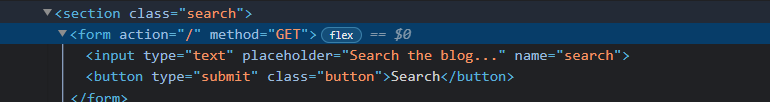
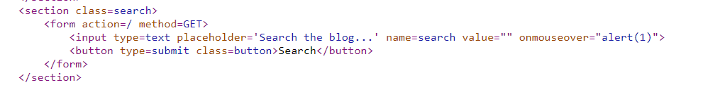

# PortSwigger Lab: Cross-site scripting

## Lab: Reflected XSS into HTML context with nothing encoded

Đề yêu cầu dùng thanh search để hiện alert lên màn hình, kiểm tra source ta thấy web dùng lệnh GET với dữ liệu thanh search

Vậy chúng ta chỉ cần đơn giản nhập `` vào thanh search

Đoạn code thực thi sẽ bị chèn như sau, lúc này đoạn lệnh trong `` sẽ được tự động thực thi khi render trang web
  

Và kết quả

## Lab: Stored XSS into HTML context with nothing encoded

Đề cho ta gợi ý là nhập comment để gọi alert mỗi khi blog được đọc

Vào thử blog, kéo xuống cuối ta thấy phần cho phép comment, vì vậy ta thử nhập ``

Giải thích rõ hơn, lúc này mỗi khi có người truy cập đến blog này, đoạn code hiển thị phần comment như dưới sẽ được thực thi trong trình duyệt của họ, lúc đó đoạn `` sẽ được thực thi

Và kết quả thành công

## Lab: Reflected XSS with some SVG markup allowed

Vẫn là giao diện cũ, và lỗi XSS ở thanh search, tuy nhiên lần này đề đã chặn đa số các tag

Đầu tiên ta thử xem các tag nào không bị chặn, chặn gói tin search trong burp suite và gửi đến intruder

Chọn vị trí attack payload là ở ?search=<$$>

Coppy tất cả payload của xss cheat-sheet và thử

Sau khi thử ta nhận thấy chỉ có mỗi tag animatetransform là trả về 200OK

Search trên xss cheat-sheet ta nhận thấy có 3 event liên quan đến svg->animate transform

Thử từng cái 1, với ngay envent đầu tiên là onbegin, ta đã thành công

`<svg><animatetransform onbegin=alert(1) attributeName=transform>`

Đoạn code của trang sẽ thay đổi như hình dưới, `animatetransform` là thuộc tính tạo hiệu ứng (scale, rotale, ...) chúng ta đặt lệnh `onbegin=alert(1)` để chạy lệnh `alert(1)` ngay khi bắt đầu.

## Lab: Reflected XSS into attribute with angle brackets HTML-encoded

Đề cho yêu cầu là dùng xss để gọi alert qua attribute

Đầu tiên ta nhập thử ``

  
Không thành công, ta thử xem source của page

Ta nhận thấy giá trị nhập vào được đưa vào trường value=””;
  
Vậy ta có thể thêm “ và thêm vào mã độc hại
  
Ban đầu mình thử với event onmouseclick, tuy nhiên đề không chấp nhận, lúc sau thử với onmouseover thì thành công

  
Đoạn code sau khi inject, lúc này khung nhập sẽ có thêm thuộc tính onmouseover, nếu ai di chuyển chuột vào khung nhập thì đoạn `alert(1)` sẽ được thực thi

Và thành công

## Lab: Stored XSS into anchor href attribute with double quotes HTML-encoded
  
Đề yêu cầu nhập comment để gọi alert khi tên tác giả comment được click
  
Truy cập vào blog đầu tiên nhập thử một comment
  

Ta mở source và thấy như sau, phần nhập vào website sẽ được đưa vào href=””

  
Vậy ta sẽ chèn payload xss vào như sau
  
`<a href="javascript:alert(1)">XSS</a>`
  
Gửi lại comment như sau

Post comment và sau đó khi nhấn vào tên người comment sẽ được thông báo

  
Như vậy là xong

Đoạn code lúc này sẽ như sau, lúc này nếu có người click vào tên người cmt thì đúng ra sẽ chuyển hướng đến website của người đó, nhưng chúng ta nhập `javascript:alert(1)` thì lệnh `alert(1)` sẽ được thực thi

## Lab: Reflected XSS into a JavaScript string with single quote and backslash escaped
  
Đề yêu cầu nhập xss trên chuỗi search để gọi hàm alert
  
Nhập thử một script đơn giản, ta thấy phía dưới có một thông báo lỗi document.write

Kiểm tra page source, ta nhận thấy chuỗi nhập vào sẽ mã hóa các kí tự ‘ -> \’

  
Như vậy những gì ta nhập sẽ được đưa vào searchTerns, ta thấy phía trên searchTerms có tag vào trong mục search thì giá trị searchTerms sẽ dừng lại và từ đó ta có thể mở một tag script mới để thực thi code.

Tiến hành thử và thành công

  
Để rõ ràng hơn thì lúc này page source sẽ như sau, lúc này searchTerm và alert nằm ở 2 tag script khác nhau, lệnh `` sẽ được thực thi như một đoạn script bình thường

## Lab: Reflected XSS into a JavaScript string with angle brackets HTML encoded
  
Đề yêu cầu breakout javascript string và gọi alert
  
Sau khi nhập vài chuỗi thử nghiệm thì đề lab này khác lab trước một chút, đó là lab này sẽ không mã hóa kí tự ‘ mà mã hóa kí tự <. Còn lab trước là ngược lại. Vì vậy ta có thể thoát chuỗi bằng cách sử dụng ‘ thay vì </script> như lab trước. Thử với payload:  `';alert(1);var d ='`

Lúc này page source sẽ như sau, lệnh `alert(1);` là một lệnh của script và sẽ được thực thi

## Lab: Stored XSS into onclick event with angle brackets and double quotes HTML-encoded and single quotes and backslash escaped
  
Đề yêu cầu đặt xss khi người dùng click vào tên author. Khá giống với bài Stored XSS into anchor href attribute with double quotes HTML-encoded
  
Tuy nhiên lần này trang web yêu cầu phải có ‘http’ ở đầu vì vậy ta không thể dùng cách cũ. 

  
Để ý phần onclick function hàm gọi với giá trị là chuỗi nhập vào ở website. Ta có thể dùng ‘); để đóng hàm track lại và gọi thêm lệnh alert(1). Vì dấu ‘ sẽ bị thay bằng \’ nên ta có thể thay nó bằng &apos; 
  
Thử nhập` http://cobra&apos;);alert(1);//` và thành công

  
Lúc này page source sẽ là, đoạn `alert(1);` là một lệnh trong hàm track() và sẽ được thực thi chung với hàm track() khi người dùng nhấn vào tên author comment
  

## Lab: Reflected XSS into a template literal with angle brackets, single, double quotes, backslash and backticks Unicode-escaped
  
Đề yêu cầu khai thác XSS trên thanh search. Sau khi mở code thì thấy đoạn như sau

Sau khi tìm hiểu từ google thì cách khai báo trong 2 ngoặc \`\` là template literal và cho phép lồng expression vào bằng cách dùng ${ex}.  Có thể lồng vào bất cứ thứ gì từ số, chuỗi, hàm, … Vì vậy chúng ta sẽ lồng hàm alert(1) vào để gọi hàm này khi gán cho giá trị searchMessage.

`Payload: ${alert(1)}`

  
  
page source, lúc này khi gán giá trị message cho searchMessage thì hàm `alert(1)` sẽ tự động được thực thi theo cơ chế của template literal

## Lab: DOM XSS using web messages
  
Đề yêu cầu xử dụng exploit server để post messeage và `alert(document.cookie)`

Kiểm tra page source, ta thấy có phần sau

  
Hàm event listener nhận data và dùng innerHTML để đưa thẳng vào code mà không kiểm tra, vì vậy ở đây gây ra lỗi xss
  
Chúng ta có thể sử dụng exploit server như sau, thêm vào phần body, lúc này khi iframe được load thì lệnh `alert(1)` sẽ được thực thi

Sau đó store và deliver exploit to victim. Khi nạn nhân click vào đường link /exploit sẽ có giao diện như sau

  
Ở đường link exploit sẽ tạo ra một giao diện iframe sử dụng src từ trang web ban đầu chứa lỗi xss. This.contentWindow sẽ tham chiếu đến đối tượng window của trang src. Khi đó trang src nhận messeage quảng cáo và post lên, tuy nhiên vì src=1 không xác định nên hàm onerror được thực hiện, gọi `alert(document.cookie)`

